# RepoMind

AI codebase intelligence and developer onboarding platform — connect a GitHub repository and get answers, architecture insight, PR risk analysis, and onboarding docs grounded in the actual code, not a generic AI chat wrapper.

RepoMind indexes a repository's real structure (files, symbols, imports, commit history) into Postgres + pgvector, then uses that index — not the model's imagination — to answer questions, visualize the dependency graph, flag risky pull requests, and generate a new developer's onboarding guide. Every answer cites a real file and line range; every architecture edge is a real import; every analytics number is computed from real commits, not sampled or guessed.

Built end-to-end as a single-author project across 16 phases: foundation → auth/multi-tenancy → GitHub integration → codebase indexing → the AI/RAG engine → the architecture explorer → PR intelligence → developer onboarding → engineering analytics → real-time infrastructure → SaaS management (billing/RBAC/audit logs) → a full-application security audit → a professional design pass → a real test suite → production CI/CD → this documentation. See [`docs/architecture/`](docs/architecture/) for the design decisions behind each one.

---

## Demo

**Live demo:** _[add your deployed URL here once provisioned — see `docs/deployment/ci-cd.md`]_
**Demo video:** _[add a walkthrough video/GIF link here]_

---

## Screenshots

All screenshots below are real, taken against a running build of this application (`pnpm build` + the production standalone server), seeded with realistic — not fabricated — demo data. See [`/screenshots`](screenshots/).

### Landing page

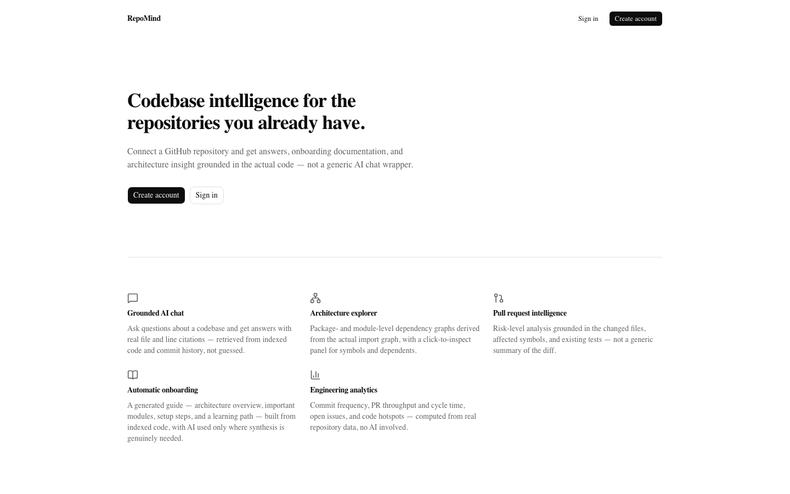

### Dashboard

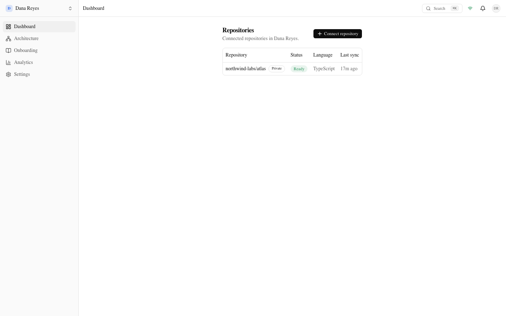

### Repository overview

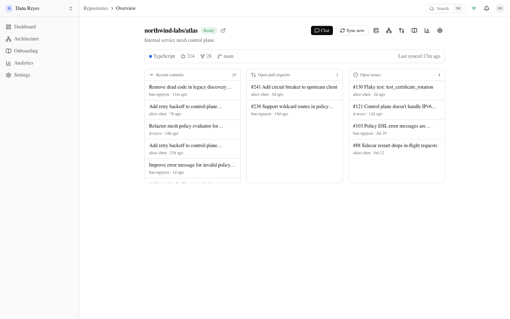

### AI Codebase Assistant

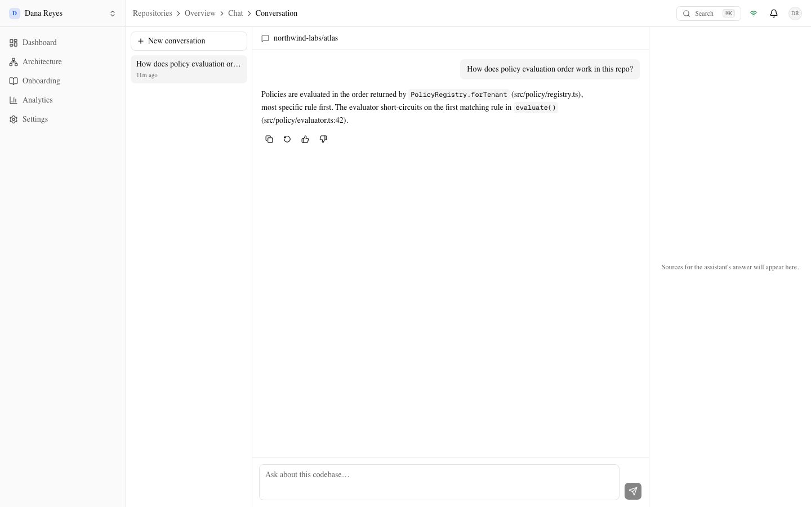

### Architecture Explorer

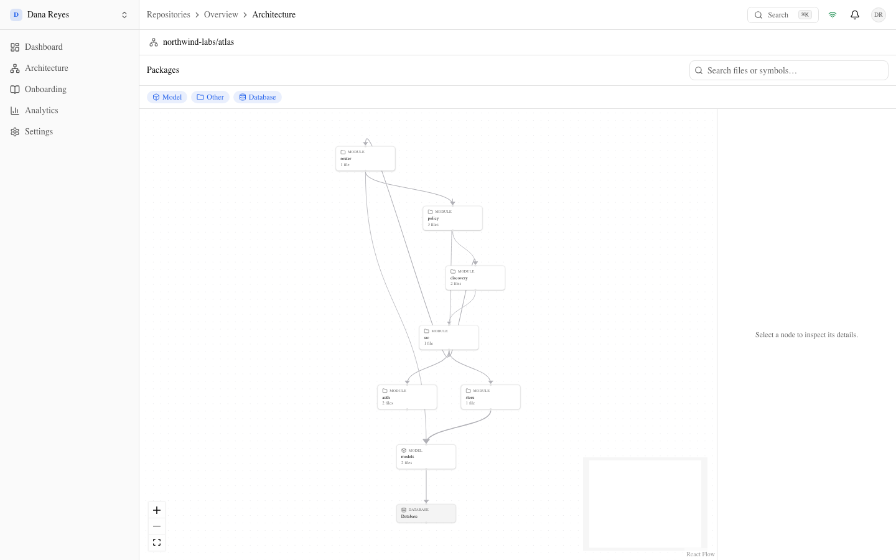

### PR Intelligence

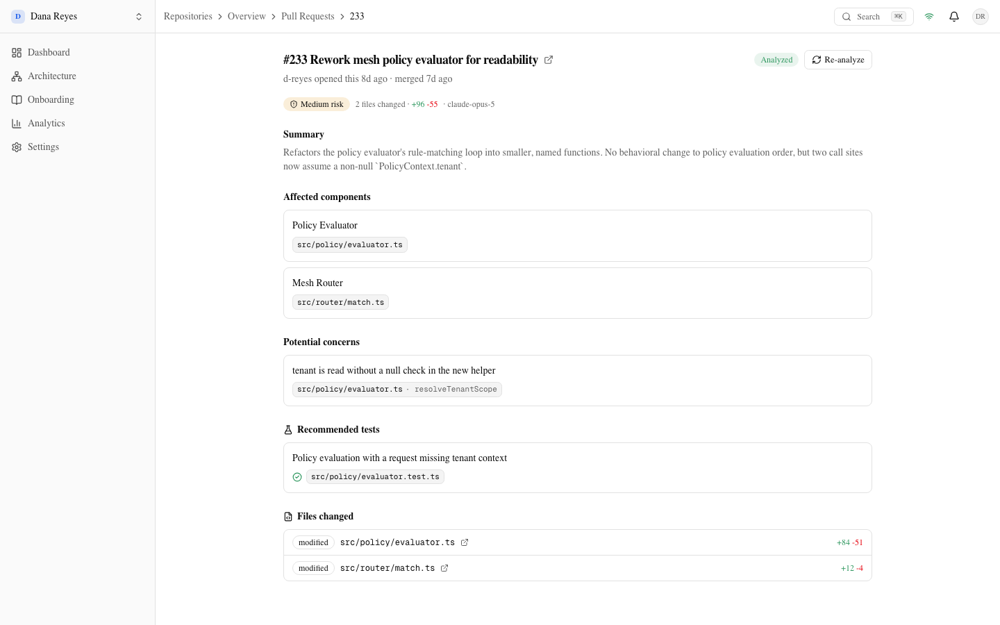

### Onboarding

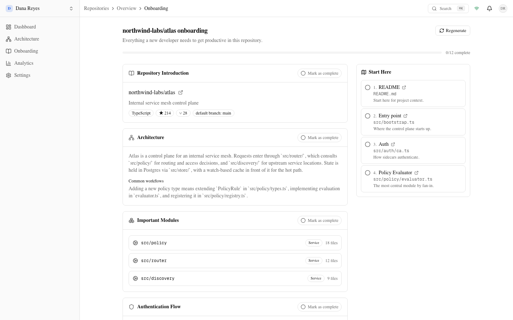

### Analytics

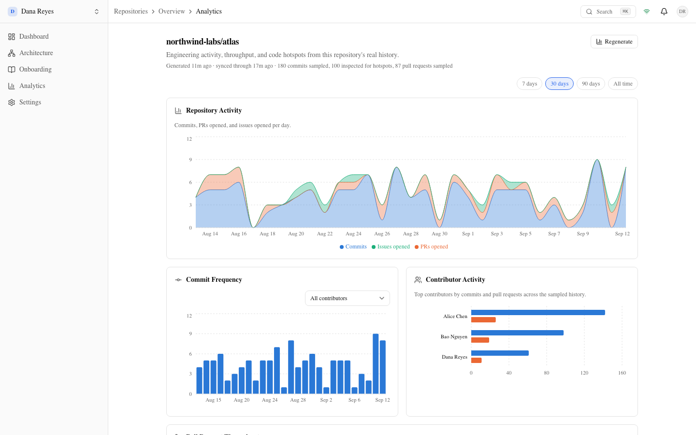

---

## Features

**GitHub integration.** A GitHub App (not a personal access token) handles installation, repository selection, and secure, idempotent webhook sync (push/PR/issue events, HMAC-verified, deduplicated by delivery ID). A separate GitHub OAuth App handles login — kept deliberately distinct from the App's own repository-access credentials so a login-only user can never mint a repository installation token.

**Codebase indexing.** A shallow git clone, `.gitignore`-aware file discovery, and a size/denylist filter feed an AST-aware chunking pipeline — never naive line-splitting. Runs on `arq`/Redis as a background job, with live progress pushed to the browser over WebSockets.

**AST-aware code analysis.** `tree-sitter` parses Python, JavaScript, TypeScript, and Go into real syntax trees, extracting functions/classes/methods with their line ranges and doc comments, and every file's actual `import`/`from` statements — the same import graph both the architecture explorer and PR analysis reason over, not a second, separately-guessed model of the codebase.

**Vector search.** Every chunk is embedded (`voyage-code-3`) and stored in Postgres via `pgvector`, indexed with HNSW for approximate nearest-neighbor search scoped to one repository at a time — no separate vector database, no cross-tenant leakage possible at the query level.

**RAG (retrieval-augmented generation).** A small LangGraph pipeline classifies query intent (explain / locate / dependency / history / general) and routes to the retrieval strategy that actually answers it — vector search, the import graph, or git history — then reranks candidates (`rerank-2.5`) before they ever reach the LLM.

**AI assistant.** A three-pane chat interface — conversation history, a streamed markdown answer with syntax highlighting and clickable inline citations, a source panel — backed by Claude Opus 5 (or a free local Ollama model). Every citation is a real `file_path:start_line-end_line` from the retrieval step, not inferred from the model's text after the fact.

**Architecture visualization.** Package- and module-level dependency graphs (`@xyflow/react` + `dagre` layout) derived from the same indexed import data — pan/zoom/search/filter, progressive package → module expansion, and a click-to-inspect panel showing a file's symbols, dependencies, dependents, and recent commits.

**PR intelligence.** Risk-level analysis for a pull request, grounded in its actual changed files, the symbols they affect, who else depends on them, and whether an existing test already covers the change — cached per commit SHA, re-triggered only when the PR moves.

**Developer onboarding.** A generated guide — architecture overview, important modules, dev setup steps, database structure, a ranked learning path, FAQ — mostly deterministic from the index (dependency fan-in, file counts, detected dependencies), with AI reserved only for the parts that genuinely need synthesis (the architecture narrative, workflow descriptions). Per-developer progress tracking, not a static document.

**Analytics.** Commit frequency, PR throughput and cycle time, open-issue age, contributor activity, and file/package-level code hotspots — every number computed directly from real commit/PR/issue data. No AI involved, no invented metrics.

**Multi-tenancy.** Organizations own repositories; a `RepositoryMembership` table (not a coarse "everyone in the org can see everything" rule) governs exactly who can see which repository, auto-granted on connect and on joining, individually revocable by an admin. Verified in an explicit cross-tenant test suite — see `docs/architecture/security.md`.

**RBAC.** Four roles (owner/admin/developer/viewer), enforced through one small `role_at_least` comparison used everywhere a role check happens — not duplicated ad hoc per route. Owner-only (plan changes), admin-only (member management, API keys, repository access), and self-service (leaving an org) actions are each gated at the exact right level.

**Real-time indexing.** A unified WebSocket event system, backed by Redis pub/sub (one channel per organization), pushes indexing progress, sync status, webhook processing, and AI generation status straight into the frontend's cache — no polling, reconnect with backoff, a live connection-status indicator.

**Audit logs.** Every sensitive organization action (member added/removed/role-changed, plan changed, API key created/revoked) is written to an admin-visible audit log — who did what, when, to what.

---

## Tech stack

| Layer | Choice |
|---|---|
| **Frontend** | Next.js 16 (App Router, Turbopack), TypeScript, Tailwind CSS v4, shadcn/ui on `@base-ui/react`, TanStack Query, Framer Motion, `@xyflow/react` + `dagre` (graph layout), `recharts` (charts), `react-markdown` |
| **Backend** | FastAPI, Pydantic v2, SQLAlchemy 2 (async), Alembic, Python 3.12, dependency-managed with `uv` |
| **Database** | PostgreSQL 16 + `pgvector` (HNSW index for embedding similarity search) |
| **AI** | Anthropic Claude Opus 5 (chat, adaptive thinking) or a free local Ollama model — swappable behind one `AIProvider` interface; Voyage AI `voyage-code-3` (embeddings) + `rerank-2.5` (reranking); LangGraph (retrieval orchestration) |
| **Infrastructure** | `arq` + Redis (background job queue: indexing, PR analysis, onboarding, analytics), Redis pub/sub (real-time WebSocket event bus), Docker + Docker Compose |
| **Testing** | Backend: `pytest` (329 tests — unit, service, repository, API-integration, and explicit cross-tenant authorization tests, real Postgres+Redis, no mocked DB). Frontend: Vitest + React Testing Library (90 tests — unit, component, and critical-user-flow interaction tests). See `docs/development/testing-strategy.md`. |
| **CI/CD** | GitHub Actions — `frontend-ci.yml`, `backend-ci.yml` (lint, typecheck, test, build), `security.yml` (dependency audit, secret scanning, vulnerability scanning). See `docs/deployment/ci-cd.md`. |

---

## System architecture

Full write-up: **[`docs/architecture/system-architecture.md`](docs/architecture/system-architecture.md)**.

### Request path

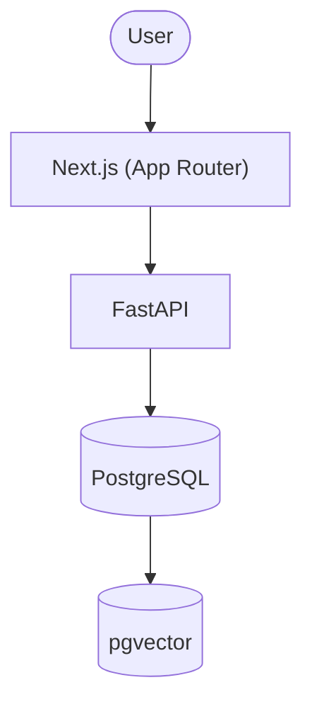

### Ingestion path

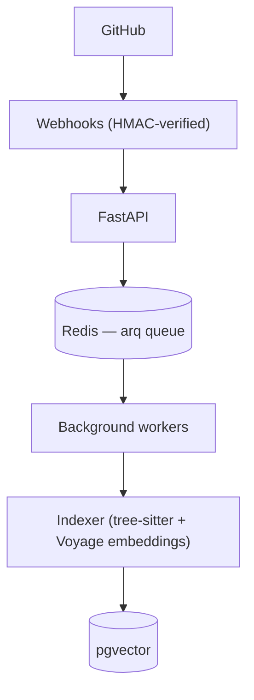

### AI answer path

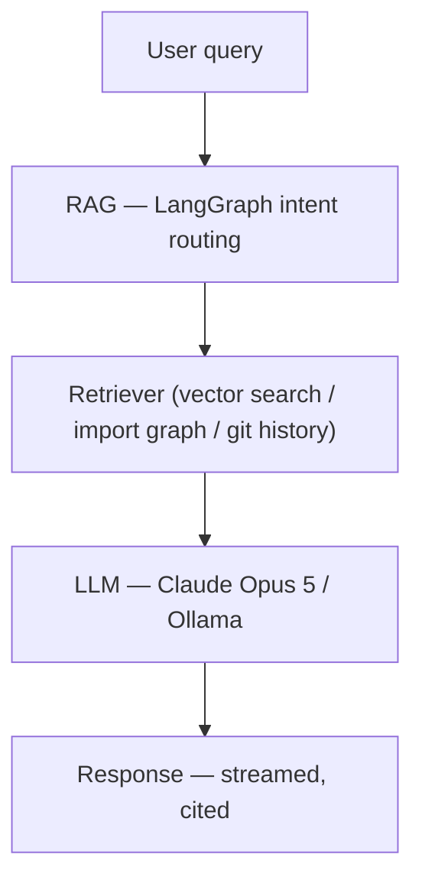

---

## Folder structure

```
RepoMind/
├── frontend/                    Next.js 16 (App Router)
│   ├── app/                     Routes — (auth)/ and (dashboard)/ route groups
│   ├── components/              UI components (ui/, shell/, chat/, architecture/, ...)
│   ├── lib/                     API client, realtime, types, validation
│   ├── test/                    Shared test factories + render helpers
│   └── Dockerfile
│
├── backend/                     FastAPI (async)
│   ├── app/
│   │   ├── api/v1/routes/       HTTP route handlers
│   │   ├── services/            Business logic — the only layer routes call into
│   │   ├── repositories/        DB access — the only layer that talks to the ORM
│   │   ├── models/              SQLAlchemy models
│   │   ├── schemas/             Pydantic request/response models
│   │   ├── ai/                  AIProvider / EmbeddingProvider abstractions + providers
│   │   ├── indexing/            Clone, discovery, chunking pipeline
│   │   ├── architecture/        Dependency graph builder
│   │   ├── retrieval/           RAG: intent routing, vector search, reranking
│   │   ├── pr_analysis/         PR diff parsing + risk analysis context
│   │   ├── onboarding/          Onboarding guide generation
│   │   ├── analytics/           Commit/PR/issue metric computation
│   │   ├── billing/             Centralized plan entitlements
│   │   ├── events/              Real-time WebSocket event bus
│   │   ├── integrations/github/ GitHub App, OAuth, webhooks, REST client
│   │   ├── core/                Config, security (JWT, passwords, rate limiting)
│   │   └── workers/             arq background job definitions
│   ├── alembic/                 Database migrations
│   ├── tests/                   unit/ + integration/, factories.py
│   └── Dockerfile
│
├── docs/
│   ├── architecture/            System design + 11 architecture decision records + security.md
│   ├── deployment/              ci-cd.md, deployment.md
│   ├── development/             getting-started.md, testing-strategy.md
│   └── product/                 Product scope
│
├── screenshots/                 Real screenshots used in this README
├── docker-compose.yml           Postgres (pgvector) + Redis + api + worker + web
└── .github/workflows/           frontend-ci.yml, backend-ci.yml, security.yml
```

---

## Local development

Full instructions: **[`docs/development/getting-started.md`](docs/development/getting-started.md)**.

### Requirements

- Node.js ≥ 20 with Corepack enabled (`corepack enable`), for pnpm
- Python 3.12, managed via [uv](https://docs.astral.sh/uv/)
- Docker (for local Postgres + Redis)

### Environment variables

```bash
cp backend/.env.example backend/.env    # complete reference — every backend/app/core/config.py field
cp frontend/.env.example frontend/.env  # NEXT_PUBLIC_API_URL — the only frontend env var
```

`backend/.env.example` is a full, verified mirror of every setting the backend reads — secrets (`JWT_SECRET`, GitHub App credentials, AI provider keys) alongside tunables that already have sane defaults. Never commit a populated `.env` — both are gitignored.

### Database setup + migrations

```bash
docker compose up -d postgres redis
docker exec repomind-postgres-1 createdb -U repomind repomind_test   # separate DB the test suite truncates between runs

cd backend
uv sync
uv run alembic upgrade head
```

### Backend

```bash
cd backend
uv run uvicorn app.main:app --reload --port 8000
uv run arq app.workers.settings.WorkerSettings   # background worker, separate terminal
```

### Frontend

```bash
cd frontend
pnpm install
pnpm dev
```

- API: http://localhost:8000 (`/docs` outside production)
- Web: http://localhost:3000

---

## Docker

`docker-compose.yml` defines five services: `postgres` (`pgvector/pgvector:pg16` — plain Postgres won't do, the `vector` extension has to actually be present), `redis`, `api` and `worker` (built from one shared `backend/Dockerfile`, differing only in their `command:` — the same two-process-group shape the production deployment uses), and `web` (`frontend/Dockerfile`, a multi-stage Next.js standalone build).

```bash
cp backend/.env.example backend/.env   # fill in secrets first
docker compose up -d --build
```

`api`'s command runs `alembic upgrade head` before `uvicorn` starts, so migrations apply automatically on every `up`. See [`docs/development/getting-started.md`](docs/development/getting-started.md#running-everything-in-docker) for the full breakdown (including the `NEXT_PUBLIC_API_URL`-is-baked-in-at-build-time and `OLLAMA_HOST`/`host.docker.internal` gotchas) and [`docs/deployment/ci-cd.md`](docs/deployment/ci-cd.md) for how these same images get to production.

---

## Testing

Full strategy: **[`docs/development/testing-strategy.md`](docs/development/testing-strategy.md)**.

```bash
# Backend — 329 tests: unit, service, repository, API integration, cross-tenant authorization
cd backend
docker compose up -d postgres redis   # from repo root
uv run ruff check . && uv run mypy app && uv run pytest -q

# Frontend — 90 tests: unit, component, critical-user-flow interaction
cd frontend
pnpm lint && pnpm exec tsc --noEmit && pnpm test && pnpm build
```

Both suites run against **real dependencies**, not mocks of them — the backend suite hits a real Postgres and Redis; the only things faked are genuinely external systems (the GitHub API, AI providers). `backend/tests/factories.py` and `frontend/test/factories.ts` give every test a one-line way to build a fully-shaped fixture instead of hand-rolling one. Shared fixtures (`tests/conftest.py`, `frontend/test/render.tsx`) cover auth, multi-user scenarios, and provider wrapping.

---

## CI/CD

Full plan (environments, deployment strategy, environment-variable reference, branch protection): **[`docs/deployment/ci-cd.md`](docs/deployment/ci-cd.md)**.

Three GitHub Actions workflows, each scoped to only the part of the monorepo it needs:

- **`frontend-ci.yml`** — install → lint → typecheck → test → build, on any change under `frontend/`. pnpm-store cached.
- **`backend-ci.yml`** — install → lint → typecheck → test, on any change under `backend/`, against real Postgres (`pgvector/pgvector:pg16`) and Redis service containers. uv-cache cached.
- **`security.yml`** — not path-scoped (a dependency can grow a new CVE without any code change), runs on every push/PR **and** weekly: `pnpm audit` + `pip-audit` (dependency audit), `gitleaks` (full git-history secret scan), Trivy (filesystem vulnerability + misconfiguration scan).

**Deployment** — Vercel deploys the frontend, Render/Railway deploys the API + worker (from `backend/Dockerfile`), Supabase provides managed Postgres+pgvector, Upstash provides managed Redis. All three deploy directly from a git push via their own integration — no custom `deploy.yml`, deliberately (see `ci-cd.md`'s reasoning).

---

## Security

Full audit + findings: **[`docs/architecture/security.md`](docs/architecture/security.md)**.

RepoMind went through a dedicated, full-application security audit (authentication, JWT handling, refresh-token rotation, CSRF, CORS, SQL injection, XSS, SSRF, GitHub OAuth/webhook signature verification, rate limiting, input validation, file processing, repository access, organization isolation, secrets, logging, error responses) — every high/medium finding was fixed, not just logged. Highlights:

- **Session auth**: short-lived JWT access tokens + rotating, hashed, revocable opaque refresh tokens; a startup validator refuses to run with a weak/short `JWT_SECRET` in any environment.
- **Webhook security**: HMAC-SHA256 signature verification against the raw request body before any parsing or DB access, constant-time comparison, fails closed (not open) if the secret is ever unconfigured, delivery-ID deduplication enforced at the database level.
- **Multi-tenant isolation**: every organization/repository-scoped route cross-checks the authenticated caller's own membership against the URL's ID — never "is authenticated" alone — verified with an explicit cross-tenant test suite, not just code review.
- **Rate limiting**: a Redis-backed per-IP limiter on every unauthenticated, brute-force-attractive endpoint (login, register, refresh, password reset).
- **Indexing sandboxing**: the file-discovery pipeline never follows symlinks — closing a real path-traversal vector where a connected repository could otherwise read arbitrary files off the worker's filesystem.
- **Secrets**: never in the frontend bundle, never in logs (the one place a test/dev fixture value that looked secret-shaped existed, it's now allowlisted by exact value in CI's secret scanner, not by disabling the check), never in git history (verified), and the production email sender refuses to start if it would otherwise leak a password-reset token to production logs.

---

## Roadmap

- Real transactional email provider (password reset / verification currently log to console in development, by design — see `security.md`)
- Real billing provider integration (Stripe/Paddle) — plan changes are an owner-only manual switch today, behind a `BillingProvider` abstraction ready for one
- A committed Playwright end-to-end suite, layered on top of today's backend API-integration + frontend interaction tests
- Additional indexed languages beyond Python/JavaScript/TypeScript/Go
- GitLab and Bitbucket support alongside GitHub
- Per-repository fine-grained (read/write, not just visibility) permissions
- SSO/SAML for organization login
- A CLI and/or IDE extension for asking questions without leaving the editor

---

## License

[MIT](LICENSE) © RepoMind contributors.
