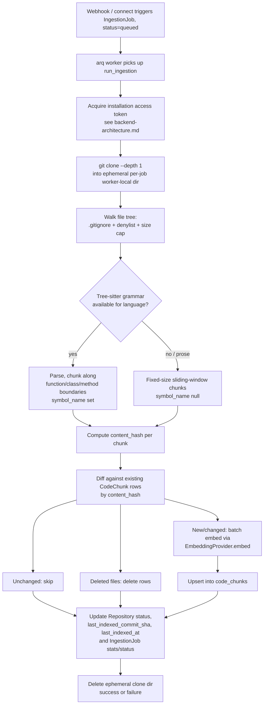
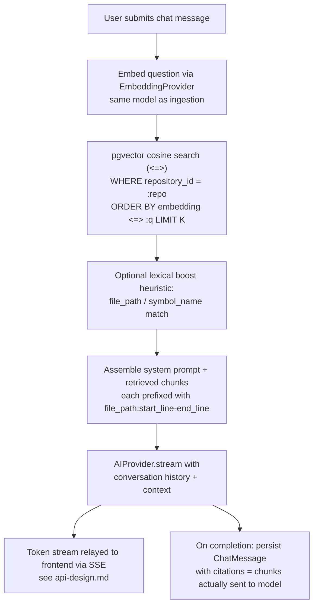

# AI Architecture

**Status:** Accepted — **superseded**, see note below
**Date:** 2026-09-08
**Depends on:** `docs/architecture/0001-foundation.md` (provider abstraction pattern, layered backend)
**Cross-references:** `docs/database/database-design.md` (schema this pipeline reads/writes),
`backend-architecture.md` (GitHub installation-token flow, installation-token Redis cache),
`api-design.md` (SSE relay of the token stream to the frontend)

> **This document was written in Phase 1, as a plan, before any of it was
> built.** Everything about **ingestion** (chunking, tree-sitter, the
> `IngestionJob`/`code_chunks`-with-inline-embedding schema, `app/workers/`)
> was superseded by what was actually implemented in Phase 4 — see
> `docs/architecture/0004-codebase-indexing.md`, which is the source of
> truth for the real pipeline, table names, and worker task shape. The
> `AIProvider`/`EmbeddingProvider` abstraction pattern and the Voyage/
> `voyage-code-3` reasoning in section 1 below held up and were implemented
> as planned — Phase 5 additionally added a `Reranker` abstraction
> alongside them, not anticipated here. **Retrieval/search** (section on
> pgvector cosine-search chat context) was built in Phase 5, materially
> differently from this section's plan — a LangGraph-orchestrated hybrid
> pipeline (vector + import-based dependency graph + git-history keyword
> search, reranked), not a single pgvector query — see
> `docs/architecture/0005-ai-rag-engine.md`, the source of truth for what
> was actually built.

This document covers the two things Phase 1 actually builds AI logic around:
ingesting a connected repository into searchable, embedded chunks, and
answering a chat question against those chunks with cited, streamed
responses. It extends the `AIProvider` abstraction from ADR 0001 with a
parallel `EmbeddingProvider` abstraction; it does not change anything about
how `AIProvider` itself works.

## 1. Provider abstractions

`app/ai/` currently holds one abstraction (`AIProvider`, for chat completion).
This phase adds a second, structurally identical one for embeddings, and
extends the factory to wire both up from settings.

### 1.1 `AIProvider` (existing, unchanged)

`app/ai/provider.py` — `complete()` and `stream()`, implemented by
`app/ai/providers/anthropic_provider.py` against Claude Opus 5 with adaptive
thinking. The RAG chat pipeline (section 3) is the primary caller of
`stream()`. Nothing in this document changes this interface; it's described
here only to establish the pattern the new abstraction mirrors.

### 1.2 `EmbeddingProvider` (new)

`app/ai/embedding_provider.py`:

```python
class EmbeddingProvider(ABC):
    """Abstraction over a text-embedding model provider.

    Mirrors AIProvider: ingestion and retrieval code depend only on this
    interface, never on a specific vendor SDK, so the embedding model can be
    swapped without touching call sites — and, notably, without touching the
    chat-completion provider, since embeddings and chat completion are
    independent axes of vendor choice.
    """

    @abstractmethod
    async def embed(self, texts: list[str]) -> list[list[float]]:
        """Return one embedding vector per input text, same order, same length."""
        ...
```

Implementation: `app/ai/providers/voyage_provider.py`, using Voyage AI's
`voyage-code-3` model.

**Why Voyage, and why `voyage-code-3` specifically:**

- Anthropic has no first-party embeddings API. Voyage AI is Anthropic's
  recommended embeddings partner for teams standardized on Claude, which
  keeps the AI vendor surface to two well-supported providers instead of
  introducing a third for no reason other than embeddings.
- `voyage-code-3` is trained specifically for source-code retrieval, as
  opposed to a general-purpose text embedding model (e.g. `voyage-3` or
  OpenAI's `text-embedding-3`) tuned for prose similarity. Code has
  different statistical structure than prose — identifiers, syntax,
  cross-file symbol references — and a code-specific model is expected to
  produce more relevant nearest neighbors for "find the code that does X"
  queries than a general-purpose model would. This is the load-bearing
  reason RAG retrieval quality depends on; see section 4 ("why not a
  general-purpose embedding model").

**Output dimension — confirm before implementation.** This document does not
assert a specific dimension for `voyage-code-3`'s output vectors as verified
fact. The actual dimension must be confirmed against Voyage's live API
response (or current API docs) before the first Alembic migration is
written, because the `code_chunks.embedding` pgvector column width must
match it exactly (see `database-design.md` section 3). Do not hardcode a
remembered number into the migration without checking.

Batch size for `embed()` calls is a tunable, bounded by whatever request
limits Voyage's API currently enforces (payload size and/or item count) —
also confirm at implementation time rather than picking an arbitrary
constant now.

### 1.3 `app/ai/factory.py`

Extends to select both providers from `Settings`, same pattern as today:

```python
@lru_cache
def get_ai_provider() -> AIProvider: ...        # existing

@lru_cache
def get_embedding_provider() -> EmbeddingProvider:
    settings = get_settings()
    if settings.embedding_provider == "voyage":
        return VoyageProvider(api_key=settings.voyage_api_key, model=settings.voyage_model)
    raise ValueError(f"Unsupported embedding provider: {settings.embedding_provider}")
```

`Settings` gains `embedding_provider`, `voyage_api_key`, `voyage_model`,
mirroring the existing `ai_provider` / `anthropic_api_key` / `anthropic_model`
fields. Business logic depends on `EmbeddingProvider`, never on the `voyageai`
SDK directly.

## 2. Ingestion pipeline

Triggered by an `IngestionJob` row (see `database-design.md`), executed
entirely inside an `arq` background worker — **never** inline in an API
request/response cycle. Cloning, walking, parsing, and embedding a
repository takes minutes, which is incompatible with a synchronous HTTP
request; the API only enqueues the job and returns immediately.



Steps:

1. **Acquire token, shallow clone.** `app/integrations/github/app_client.py`
   provides a short-lived GitHub installation access token (documented in
   `backend-architecture.md`; ingestion depends on it but does not own it).
   `git clone --depth 1` into an ephemeral, per-job worker-local directory.
   That directory is deleted when the job finishes, success or failure —
   nothing about a cloned repo persists on the worker filesystem beyond the
   job's lifetime.

2. **Walk the file tree.** Respect the repository's `.gitignore`, plus a
   hardcoded denylist (binary extensions, images, lockfiles, `node_modules`,
   `.git`, vendored/generated directories) and a per-file size cap (e.g.
   500KB, tunable) so generated/vendored code and binaries are never
   embedded — both for retrieval quality (nobody wants a minified bundle in
   their context window) and for cost.

3. **Chunk.** For source files in a language with a tree-sitter grammar,
   parse and chunk along function/class/method boundaries so each chunk is
   a coherent semantic unit, and set `symbol_name` to the enclosing
   function/class/method name. For prose (README, docs) and any file that
   fails to parse, fall back to fixed-size sliding-window chunking (e.g.
   ~200 lines with overlap, tunable) with `symbol_name` left null. This
   dual strategy is why `CodeChunk.symbol_name` is nullable and why
   `language` is tracked per chunk rather than assumed from the repository
   as a whole.

4. **Hash and diff.** Compute `content_hash` (sha256 of the chunk's
   normalized content) per chunk. On re-ingestion — triggered by a GitHub
   webhook push — diff the new chunk set against the repository's existing
   `CodeChunk` rows by `content_hash`:
   - Unchanged chunks: left alone, **not** re-embedded. This is the primary
     cost-control lever — a push that touches five files out of five
     thousand re-embeds five files' worth of chunks, not the whole repo.
   - New/changed chunks: (re-)embedded.
   - Chunks whose files no longer exist: deleted.

5. **Batch-embed and upsert.** New/changed chunks go through
   `EmbeddingProvider.embed()` in batches (batch size tuned to Voyage's
   request limits — a tunable, confirmed at implementation time, not a
   fixed constant asserted here) and are upserted into `code_chunks`.

6. **Finalize.** Update `Repository.status` (`ready` or `failed`),
   `last_indexed_commit_sha`, `last_indexed_at`, and the `IngestionJob`'s
   `status`/`finished_at`/`stats` (e.g. `files_processed`, `chunks_created`,
   `chunks_reused`, `tokens_embedded` — see `database-design.md` for the
   `stats` jsonb shape).

`app/workers/` holds the arq task functions, e.g.
`run_ingestion(repository_id, commit_sha)`. A separate process runs the
worker (`arq app.workers.main.WorkerSettings`) — it is never embedded in the
API process. Redis backs the arq queue and is also reused as the
installation-token cache (see `backend-architecture.md`); one Redis instance
serves both roles at this scale.

**Why arq over Celery:** the backend is already async end-to-end (FastAPI +
async SQLAlchemy). arq is an async-native, Redis-backed task queue with no
sync-worker model to bridge into an async codebase — Celery's worker model
is fundamentally synchronous (or requires eventlet/gevent monkey-patching to
behave otherwise), which would mean either a second concurrency paradigm in
the codebase or fighting Celery's execution model to get async I/O inside a
task. arq avoids that mismatch entirely.

## 3. Retrieval pipeline (chat)

Triggered per chat message. Unlike ingestion, this path **is** inline in the
request — it must feel responsive — but the response is streamed, not
buffered, so perceived latency is bounded by time-to-first-token rather than
total generation time.



1. **Embed the question.** Uses the same `EmbeddingProvider` implementation
   and model as ingestion — this is a hard requirement, not a style
   preference. Embeddings from different models are not comparable; a
   query embedded with a different model than the corpus would produce
   meaningless similarity scores against `code_chunks.embedding`.

2. **Vector search.** pgvector cosine-similarity search (`<=>` operator)
   over `code_chunks`, scoped to `repository_id`, returning the top-K (e.g.
   12, tunable) nearest chunks, using the HNSW index described in
   `database-design.md`.

3. **Optional re-ranking heuristic.** For MVP, a cheap lexical boost — e.g.
   nudge up chunks whose `file_path` or `symbol_name` lexically matches
   terms in the question — rather than a separate cross-encoder reranker
   model. See section 4 for why a real reranker is deferred, not omitted
   outright.

4. **Assemble context and call the LLM.** Build a system prompt plus the
   retrieved chunks, each prefixed with a `file_path:start_line-end_line`
   header so the model can cite accurately (this header format is also what
   the model is instructed to reproduce in its citations). Call
   `AIProvider.stream()` with the conversation history plus this assembled
   context.

5. **Stream and persist.** Response tokens stream out of the service as an
   async token stream; the API layer relays them to the frontend over SSE
   (`api-design.md`'s concern — this service only needs to produce the
   stream). On stream completion, persist the `ChatMessage` row with
   `citations` set to the chunks that were **actually included in the
   context that turn** — not the full retrieved set, since the re-ranking
   step in point 3 may narrow or reorder what's sent to the model, and a
   citation pointing at a chunk the model never saw would be misleading.

### 3.1 Context window and cost management

The retrieved chunks plus conversation history must fit comfortably under
Claude Opus 5's context window while leaving room for a substantial
response — this is a per-turn budget the retrieval assembly step (point 4
above) must respect, trimming lowest-ranked chunks first if the budget is
tight. As a chat session grows long, the conversation history itself will
eventually need truncation or summarization to stay within that budget;
this is explicitly a **Phase 2+ concern**, not solved in the MVP cut. The
schema doesn't block adding it later: `ChatMessage` is append-only, one row
per turn, so a future summarization pass can read the full history and
write a derived summary without any schema change — it's a service-layer
addition, not a migration.

## 4. Why not X

**Why not a dedicated vector database (Pinecone, Weaviate, Qdrant) instead
of pgvector?** One fewer service to run, operate, and pay for at this
scale. Postgres is already a hard dependency for every other table in the
system (`database-design.md`); pgvector adds vector search as an extension
to infrastructure that already exists, rather than standing up and
operating a second stateful service with its own auth, backup, and
networking story. Revisit only if vector search becomes the actual
bottleneck — this MVP's expected scale (single-digit-to-low-hundreds of
repositories, each in the thousands-of-chunks range) is well within what a
single well-indexed Postgres instance handles.

**Why not a general-purpose embedding model instead of a code-specific
one?** Retrieval quality is the whole point of the RAG pipeline — a wrong
or irrelevant chunk retrieved is a wrong or irrelevant answer, no matter how
good the chat model is. `voyage-code-3` is trained on code-retrieval tasks
specifically; a general-purpose text embedding model would be optimized for
prose similarity and is expected to under-perform on "find the function
that handles X" style queries, which are the majority of what this product
does. Given retrieval is the bottleneck for answer quality, the marginal
cost of using a specialized model over a general one is worth paying.

**Why not skip re-ranking entirely, and why not add a full cross-encoder
reranker now?** Covered inline in section 3, point 3: a cheap lexical
heuristic is included because it's nearly free and catches an easy class of
error (an exact symbol or filename match losing to something merely
semantically similar). A full cross-encoder reranker is deferred because it
adds a third model call (and latency) to every chat turn, and there's no
evidence yet — with zero production usage — that retrieval quality needs
it. It is explicitly noted as the first lever to pull if retrieval quality
turns out to be insufficient once real usage data exists.

## 5. Summary of new/changed files

| File                                  | Status                                                                 |
| ------------------------------------- | ---------------------------------------------------------------------- |
| `app/ai/embedding_provider.py`        | New — `EmbeddingProvider` ABC                                          |
| `app/ai/providers/voyage_provider.py` | New — Voyage `voyage-code-3` implementation                            |
| `app/ai/factory.py`                   | Extended — adds `get_embedding_provider()`                             |
| `app/core/config.py`                  | Extended — adds `embedding_provider`, `voyage_api_key`, `voyage_model` |
| `app/workers/`                        | New task functions, e.g. `run_ingestion`                               |
| `app/services/`                       | New ingestion and retrieval orchestration services                     |

`app/ai/provider.py` and `app/ai/providers/anthropic_provider.py` are
unchanged by this phase.
