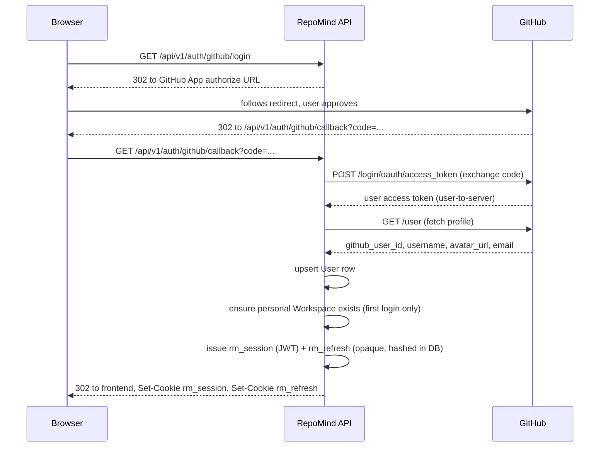
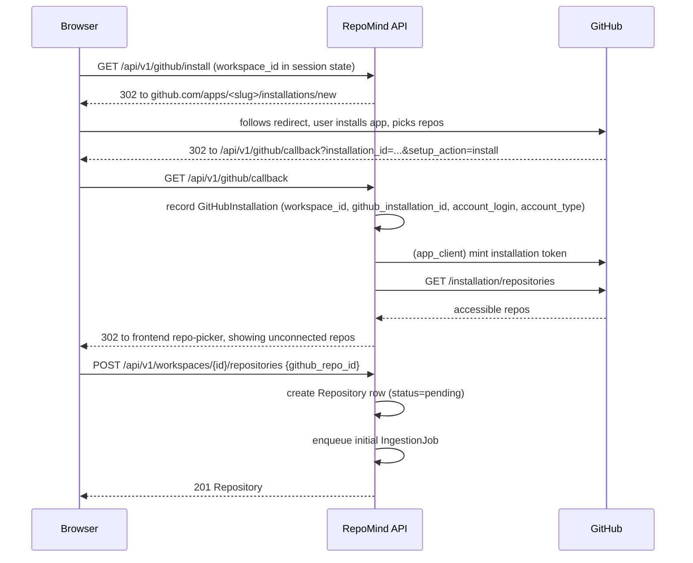

# Backend Architecture

> **Note:** the auth model and layering below matches what Phase 2
> actually shipped (see `docs/architecture/0002-auth-and-multi-tenancy.md`).
> The "GitHub App integration" section below was written as a single
> combined App (login + installation + webhooks) — Phase 3 instead built
> **two** separate GitHub integrations (an OAuth App for login, from
> Phase 2, and a distinct GitHub App for installation/webhooks, from this
> phase); see `docs/architecture/0003-github-integration.md` for the real
> design and why it split that way.

**Status:** Design (Phase 1) — targets implementation in Phase 2
**Scope:** `apps/api` internal structure, auth model, GitHub App integration
**Companion docs:** `docs/api/api-design.md` (REST surface), `docs/database/README.md`
(schema, to be written alongside the first Alembic migration), `docs/ai/`
(retrieval pipeline and embedding generation — out of scope here)

This document extends the layering established in
`docs/architecture/0001-foundation.md`. It does not repeat the monorepo or
provider-abstraction decisions already recorded there; it specifies how the
empty `app/services`, `app/repositories`, `app/domain`, `app/integrations/github`,
and `app/workers` packages get filled in for Phase 2, and defines the auth
model that every other module depends on.

## 1. Layering recap and the rule it enforces

```
app/api/v1/routes/   -> app/services/   -> app/repositories/   -> app/domain/
                           |
                           v
                    app/integrations/github/, app/ai/
```

The rule that matters more than the directory names: **routes contain no
branching business logic.** A route handler parses the request into a schema,
calls exactly one service method, and maps the result onto a response schema.
If a route needs an `if` statement beyond "was this found, return 404", that
logic belongs in the service. This is checked in review, not by tooling, but
it's the load-bearing convention for the whole backend — it's what lets
`app/services/*.py` be unit-tested without spinning up FastAPI, and what lets
`app/repositories/*.py` be swapped or mocked without touching business logic.

Concretely, for Phase 2:

- `app/services/auth_service.py` — GitHub OAuth code exchange, session
  issuance, refresh rotation, logout. Depends on `integrations/github/oauth.py`
  and `repositories/user_repository.py`, `repositories/refresh_token_repository.py`.
- `app/services/github_service.py` — orchestrates GitHub App installation
  handoff and the installation-accessible-repos listing. Depends on
  `integrations/github/app_client.py` and `repositories/github_installation_repository.py`.
- `app/services/repository_service.py` — connecting/disconnecting repositories,
  ownership checks. Depends on `repositories/repository_repository.py` and
  calls `ingestion_service.py` to kick off the initial ingest.
- `app/services/ingestion_service.py` — enqueues `IngestionJob` rows and arq
  tasks, exposes status lookups. The chunking/embedding pipeline itself is
  documented in the AI/retrieval architecture doc; this service's contract is
  "create a job, enqueue `run_ingestion`, report status" — it does not know
  how ingestion works internally.
- `app/services/chat_service.py` — creates/lists chat sessions, orchestrates a
  message turn: persist the user message, call into retrieval (documented
  elsewhere) to build context, stream from `AIProvider`, persist the assistant
  message with citations. This service owns the streaming contract described
  in `api-design.md` §Chat; it does not own retrieval ranking.

Each service module owns one bounded concern and is the only thing routes for
that concern call. Services do not call other services' repositories directly
— if `repository_service` needs to enqueue ingestion, it calls
`ingestion_service.enqueue_initial(...)`, not
`ingestion_job_repository.create(...)` itself.

### Repositories

One module per entity under `app/repositories/`: `user_repository.py`,
`workspace_repository.py`, `workspace_member_repository.py`,
`github_installation_repository.py`, `repository_repository.py`,
`ingestion_job_repository.py`, `code_chunk_repository.py`,
`chat_session_repository.py`, `chat_message_repository.py`,
`refresh_token_repository.py`. Each is a thin class or module of functions
wrapping SQLAlchemy `select`/`insert`/`update` statements against a single
`AsyncSession` (injected via `app/db/session.py:get_db_session`), returning
domain objects (`app/domain/models.py` ORM instances or lightweight dataclasses
where an ORM instance would leak unrelated columns). No conditional business
rules live here — "is this user already a member" is a repository query;
"can this user connect a private repo on the free tier" is a service decision.

### Workers

`app/workers/` holds arq task functions: `run_ingestion(ctx, job_id: UUID)`,
`send_webhook_reingest(ctx, repository_id: UUID, commit_sha: str)`. Tasks are
thin dispatchers — they load context, call the corresponding service method
(`ingestion_service.run(job_id)`), and let the service own retries/error
recording. Business logic does not live in the worker layer any more than it
lives in routes; the arq task is a delivery mechanism, not a decision point.

## 2. Auth model

RepoMind uses a single GitHub App for three purposes that would otherwise be
two separate integrations: user login ("Sign in with GitHub"), repository
installation (which repos the app can read), and webhooks (push notifications
for re-indexing). One App registration, one client ID/secret pair, one
webhook secret — see `app/core/config.py` (`github_client_id`,
`github_client_secret`, `github_webhook_secret`), which already reserves these
settings from Phase 0.

### 2.1 Login flow



The code exchange and profile fetch are implemented in
`app/integrations/github/oauth.py`, called from `auth_service.py` — never
invoked directly from the route. On first login, `auth_service.py` also
creates the user's personal `Workspace` (`name` derived from the GitHub
username, `slug` slugified and uniqued, `owner_user_id` set) and a
`WorkspaceMember` row with `role="owner"`. This auto-provisioning happens
inside the same transaction as the `User` upsert so a partially-created user
(workspace-less) is never observable.

### 2.2 Session model

Two cookies, both `httpOnly`, `Secure`, `SameSite=Lax`:

| Cookie       | Contents                                                                                  | Expiry     | Path                   | Purpose                                |
| ------------ | ----------------------------------------------------------------------------------------- | ---------- | ---------------------- | -------------------------------------- |
| `rm_session` | JWT (HS256, `jwt_secret` from config) with claims `user_id`, `active_workspace_id`, `exp` | 15 minutes | `/`                    | Authenticates every API request        |
| `rm_refresh` | Opaque random token (256-bit, base64url)                                                  | 30 days    | `/api/v1/auth/refresh` | Only ever sent to the refresh endpoint |

The refresh token is never a JWT and never contains claims — it's a bearer
value looked up in the `refresh_tokens` table, where only its SHA-256 hash is
stored (`token_hash`), alongside `user_id`, `expires_at`, `revoked_at`,
`created_at`. Scoping the cookie's `Path` to `/api/v1/auth/refresh` means the
browser never attaches `rm_refresh` to any other request — an XSS payload
that can read the DOM still cannot exfiltrate it via a normal same-origin
fetch to another endpoint, and it never appears in access logs for routes
other than the refresh endpoint itself.

`app/core/config.py`'s existing `jwt_secret` / `jwt_algorithm` fields are used
as-is for `rm_session`. No changes to Phase 0 config are needed beyond adding
the GitHub App's private key path/value for JWT-based app authentication
(§3).

### 2.3 Refresh rotation and theft detection

Every call to `POST /api/v1/auth/refresh`:

1. Looks up the presented token's hash in `refresh_tokens`.
2. If not found, or `revoked_at` is already set → **reject**, and additionally
   revoke every other non-revoked token belonging to that `user_id` (the
   "family"). A revoked token being presented again means either a stale
   client retried after rotation (benign but must still be rejected) or a
   copy was stolen and both the attacker and the legitimate client are now
   racing to use it (must assume the worst). Either way, forcing full
   re-login is the safe response — it is preferable to silently accepting
   replay.
3. If found and valid → mark it `revoked_at = now()`, insert a new
   `refresh_tokens` row, issue a new `rm_session` JWT and a new `rm_refresh`
   cookie.

This is implemented as one function, `auth_service.rotate_refresh_token`, so
the "revoke-then-issue" pair and the "replay revokes the family" branch stay
atomic under one DB transaction — a partial rotation (old token revoked, new
token not yet issued) must never be observable.

### 2.4 Request authentication dependencies

- `get_current_user` (FastAPI dependency, `app/core/` or a dedicated
  `app/api/v1/deps.py`): reads `rm_session`, verifies the JWT signature and
  `exp`, loads the `User` row via `user_repository.get(user_id)`. Raises 401
  if the cookie is missing, malformed, expired, or the user no longer exists.
  It does **not** hit the refresh endpoint itself — an expired access token
  simply fails, and the frontend's API client is responsible for calling
  `/api/v1/auth/refresh` and retrying once on a 401 (see `api-design.md`).
- `get_workspace_member` (depends on `get_current_user`, takes the
  `workspace_id` path parameter): loads the `WorkspaceMember` row for
  `(workspace_id, user_id)`, raises 403 if none exists. Routes that need a
  minimum role (e.g. only `owner`/`admin` can disconnect a repository) accept
  an optional `min_role` parameter to this dependency rather than duplicating
  the check in the service.

Every workspace-scoped route in `api-design.md` depends on
`get_workspace_member`, not just `get_current_user` — membership is
re-verified per request, not cached in the JWT beyond the `active_workspace_id`
hint used for defaulting UI state.

### 2.5 CSRF

`SameSite=Lax` already prevents `rm_session` and `rm_refresh` from being
attached to cross-site requests that aren't top-level GET navigations — this
rules out the classic ``/auto-submitting-form attack for anything other
than a same-site-feeling top-level GET, which RepoMind has no destructive GET
routes for. The residual gap `SameSite=Lax` doesn't close is a cross-site
`fetch`/XHR that a malicious page issues directly (Lax still allows the
browser to attach cookies to some cross-site sub-requests in edge cases, and
defense in depth is cheap here). The mitigation: every mutating request
(`POST`/`PUT`/`PATCH`/`DELETE`) must carry a custom header,
`X-Requested-With: RepoMind`. A cross-origin script cannot attach a custom
header to a request without triggering a CORS preflight, and the API's CORS
policy (`app/main.py`, `CORSMiddleware` with `allow_origins` from
`settings.cors_origins`) only allows the configured frontend origin — so a
third-party site's preflight fails and the browser never sends the real
request. This is the deliberate, complete CSRF mitigation for this threat
model; RepoMind does not implement a separate double-submit CSRF token
scheme, since the header check already achieves the same guarantee with less
code and no extra round trip.

### 2.6 Logout

`POST /api/v1/auth/logout` clears both cookies (`Set-Cookie` with `Max-Age=0`)
and sets `revoked_at` on the current `rm_refresh` token's row. It does not
revoke the whole family — a logout on one device should not sign the user out
everywhere.

## 3. GitHub integration architecture

`app/integrations/github/` is the only module permitted to call GitHub's
REST API. Services call functions in this module; they never construct an
HTTP request to `api.github.com` themselves. This keeps GitHub's API shape
(pagination, rate-limit headers, error format) from leaking into
`app/services/`, and means a future move to GraphQL or a vendored SDK touches
one module.

### 3.1 `app_client.py` — app and installation authentication

Two distinct token types, both short-lived, neither persisted:

1. **App JWT** — signed RS256 with the GitHub App's private key, `iss` claim
   set to the App ID, 10-minute expiry (GitHub's maximum is 10 minutes).
   Minted fresh whenever needed; cheap enough not to cache.
2. **Installation access token** — obtained via
   `POST /app/installations/{installation_id}/access_tokens`, authenticated
   with the App JWT from step 1. Valid for 1 hour. This is the token actually
   used for per-installation REST calls (listing repos, reading metadata).

Installation tokens are **never written to the database.** They're minted on
demand and cached in Redis, keyed by `installation_id`, with a TTL of 55
minutes — comfortably under the real 60-minute expiry, so a token already
close to expiring is never handed out and re-minted mid-use. This keeps the
common case (several requests against the same installation within a short
window) to one token mint per ~hour instead of one per request, without ever
persisting a live credential to a durable store.

### 3.2 `oauth.py` — user login code exchange

Implements the code-for-user-token exchange described in §2.1
(`POST /login/oauth/access_token`) and the profile fetch (`GET /user`). This
is a distinct token type and a distinct flow from installation tokens — a
user-to-server token authenticates as the person who logged in and is used
only long enough to read their profile during login; it is not stored or
reused for later API calls, which all go through installation tokens instead.

### 3.3 `webhooks.py` — signature verification and push handling

`POST /api/v1/webhooks/github` (see `api-design.md`) is the only route in the
system that does not authenticate via `rm_session`. Instead:

1. Read the raw request body (before any JSON parsing).
2. Compute HMAC-SHA256 over the raw body using `github_webhook_secret`.
3. Compare against the `X-Hub-Signature-256` header using a constant-time
   comparison (`hmac.compare_digest`), not `==`.
4. Reject with 401 before any payload parsing if the signature doesn't match.

Only after verification does the handler parse the event. For `push` events,
it extracts `repository.full_name`, the head commit SHA, and `ref`. It looks
up the matching `Repository` row by `full_name` + `github_installation_id`,
and compares `ref` against that repository's recorded `default_branch` —
pushes to any other branch are acknowledged (200) and dropped, since RepoMind
only indexes the default branch in Phase 1.

**Debouncing:** if an `IngestionJob` for this repository is already
`queued` or `running`, the handler does not enqueue a second one. Instead it
checks whether the incoming commit SHA differs from the one the in-flight job
started with; if so, it sets a `superseded` flag (part of the job's `stats`
jsonb, or a dedicated boolean column) on the in-flight job. When
`run_ingestion` finishes a job marked `superseded`, it enqueues exactly one
follow-up job for the latest known commit, rather than chaining one job per
push. This is a deliberate simplification — a full job-dependency graph is
not needed for a single-branch, single-active-job-per-repository model.

### 3.4 `repo_client.py` — minimal REST surface

Wraps exactly the calls the product needs against an installation token:
list repositories accessible to an installation
(`GET /installation/repositories`), and get a single repository's metadata
(default branch, private flag) (`GET /repos/{owner}/{repo}`). This is
intentionally not a general-purpose GitHub client — no wrapper for issues,
PRs, or other endpoints RepoMind doesn't use yet. Adding a new call means
adding a new function here, reviewed for the same auth/rate-limit handling as
the existing two.

### 3.5 Installation flow



`github_service.py` owns steps 3–6: recording the installation, listing
repos, and (via `repository_service.py` → `ingestion_service.py`) creating
the `Repository` row and enqueueing the first `IngestionJob`. The repo picker
step is deliberately separate from installation — a user may grant the App
access to more repos than they want indexed, so "installed" and "connected"
are different states (`GitHubInstallation` vs. `Repository`).

## 4. AI provider abstraction — unchanged, extended in place

`app/ai/provider.py`'s `AIProvider` ABC (`complete`, `stream`) and
`app/ai/factory.py`'s `get_ai_provider()` are Phase 0 scaffolding and are not
modified by this design. `chat_service.py` depends only on `AIProvider`; it
builds the `list[ChatMessage]` (role/content pairs) from persisted
`ChatMessage` rows plus retrieved context (assembled by the retrieval layer —
see the AI/retrieval architecture doc), calls `provider.stream(...)`, and
relays each text delta to the route as an SSE event (`api-design.md` §Chat).
Citations are derived from which `CodeChunk` rows were included in the
retrieval context, not from the provider's output — the provider is never
asked to invent file paths or line numbers. `AnthropicProvider` remains the
only implementation; nothing here requires touching
`app/ai/providers/anthropic_provider.py`.

## 5. What Phase 2 adds, precisely

Nothing in this document requires changes to `app/core/config.py` beyond
adding the GitHub App's numeric ID and private key (PEM) as new settings
fields, alongside the existing `github_client_id`/`github_client_secret`/
`github_webhook_secret`. Everything else — the service modules, repository
modules, worker tasks, and route files — is new code inside directories that
already exist and are empty. No change to the Phase 0 layering, dependency
direction, or AI provider abstraction is needed to implement this design.
