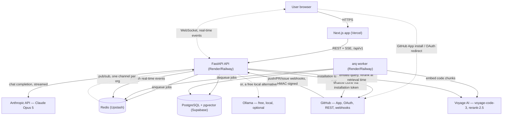
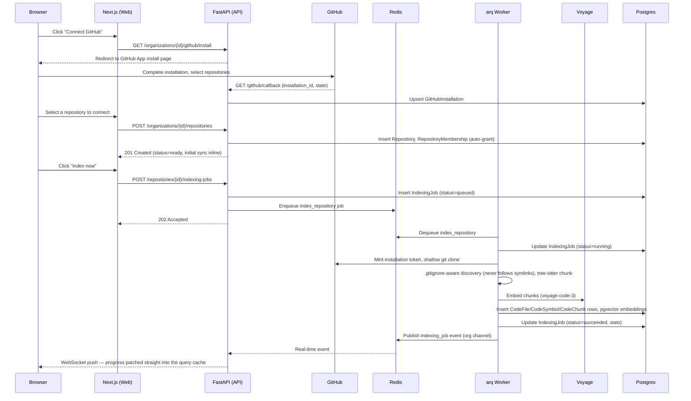
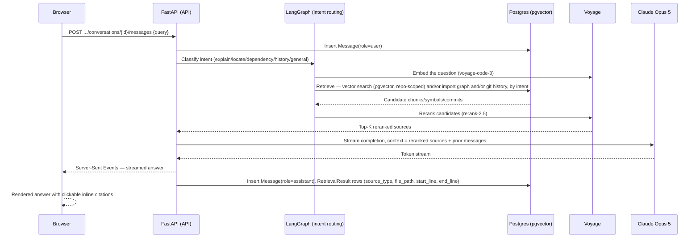

# RepoMind — System Architecture

**Status:** Current — describes the system as built across all 16 phases,
superseding the Phase 1 target-architecture draft this file used to be.
**Companion docs:** `frontend-architecture.md`, `backend-architecture.md`,
`ai-architecture.md`, `design-system.md`, `security.md`, and the numbered
architecture decision records `0001`–`0011` (one per major phase — GitHub
integration, indexing, the RAG engine, the architecture explorer, PR
intelligence, onboarding, analytics, real-time infrastructure, SaaS
management) each go into implementation depth this document doesn't;
`docs/deployment/ci-cd.md` is the current, authoritative deployment plan.

## 1. System context

The browser never talks to GitHub, Anthropic, or Voyage directly except
for the GitHub App installation/OAuth redirect flow — a standard browser
redirect to `github.com` and back. No third-party credentials ever reach
the frontend; every AI-provider and GitHub API call is made server-side.

**Deployment.** Vercel (frontend), Render or Railway (API + worker, from
one shared `backend/Dockerfile`), Supabase (managed Postgres with
`pgvector`), Upstash (managed Redis) — see `docs/deployment/ci-cd.md` for
the full plan, environment variables, and why this stack. Nothing is
provisioned yet as of this writing; this is the plan to provision
against.

## 2. High-level component responsibilities

**Web (`frontend`, Next.js 16 App Router).** Renders the dashboard,
repository connection flow, indexing status, the three-pane chat
interface, the architecture explorer (`@xyflow/react` + `dagre`), PR
intelligence, onboarding, analytics, and organization/settings
management. Server components fetch initial page data directly from the
API; client components handle interactive state (chat streaming, live
indexing progress, dependency-graph interaction) via TanStack Query plus
a WebSocket connection that patches the query cache in place. Holds no
secrets and makes no direct calls to GitHub, Anthropic, or Voyage — every
data access goes through the FastAPI backend over `/api/v1`.

**API (`backend`, FastAPI).** The single point of contact for the
frontend and for GitHub webhooks. Owns authentication (JWT session +
rotating refresh tokens), request validation, authorization
(organization-role and per-repository-membership checks — see §4.1),
synchronous reads, the chat request path (embed query, retrieve, rerank,
stream completion), and publishing real-time events. Nothing that could
block a request thread — indexing, PR analysis, onboarding-guide
generation, analytics-snapshot generation — runs inline; the API only
enqueues work onto Redis and returns.

**Worker (`app/workers`, arq, a separate process from the API).**
Consumes queued jobs from Redis: repository indexing (initial connect,
webhook-triggered re-index, manual re-index), PR risk analysis,
onboarding-guide generation, and analytics-snapshot generation. Runs as
its own deployable process so a slow or failing job can never degrade API
request latency — the same reasoning that put indexing on a queue instead
of a request handler in the first place.

**Database (PostgreSQL + pgvector).** System of record for every domain
entity (users, organizations, organization members, repository
memberships, repositories, branches/commits/PRs/issues, indexing jobs,
code files/symbols/chunks/embeddings, conversations/messages, PR
analyses, onboarding guides, analytics snapshots, API keys, audit logs)
and for vector search over `CodeChunk.embedding` via an HNSW index. One
database serves both relational and vector-search workloads.

**GitHub App + OAuth App (two distinct credential sets).** The GitHub
App handles installation (repository access grants) and webhooks — it is
never used for login. A separate GitHub OAuth App handles "Continue with
GitHub" login only. Both are isolated behind `app/integrations/github/`
so nothing else in the backend talks to GitHub's API surface directly.

**AI providers (Anthropic/Ollama, Voyage).** Two distinct concerns
behind two abstractions in `app/ai/`: `AIProvider` (chat
completion/streaming — Claude Opus 5 with adaptive thinking, or a free
local Ollama model, chosen by one config flag) and `EmbeddingProvider`
(text embedding — Voyage's `voyage-code-3`, chosen because Anthropic has
no first-party embeddings API and Voyage is Anthropic's recommended
embeddings partner for code). A third abstraction, `Reranker`, sits
between retrieval and generation (`rerank-2.5`). Business logic depends
only on these interfaces, never on the underlying SDKs — swapping
providers is a config change, not a refactor.

**Real-time event bus (`app/events/`).** A unified WebSocket event
system, one Redis pub/sub channel per organization. Every service that
produces a long-running artifact (indexing, sync, webhook processing, PR
analysis, onboarding, analytics) publishes onto it; the WebSocket route
is the only subscriber, fanning events out to every connected browser for
that organization. The frontend patches its own query cache directly
from event payloads instead of invalidating and refetching, so the UI
updates with no loading flash for state that already arrived over the
wire.

**Entitlements (`app/billing/`).** One centralized module —
`PLAN_LIMITS`, `ensure_can_add_repository`, `ensure_can_add_member` — is
the only place a resource count is compared against a plan limit
anywhere in the codebase. A `BillingProvider` abstraction exists with one
implementation (`NullBillingProvider`) pending a real payment provider;
until then, plan changes are an explicit, owner-only manual action, and
the billing page says so.

## 3. Request / data flow

### 3.1 Connecting and indexing a repository

Failure handling: if the clone fails, a file exceeds size/type limits, or
an embedding call errors out, the worker records `IndexingJob.status=
failed` with a populated `error`. A job never stays `queued`/`running`
indefinitely — every job either succeeds or fails visibly, and the
failure is exactly what the UI shows the user who triggered it.

### 3.2 Asking a codebase question (RAG)

Retrieval is always scoped to a single `repository_id` — a conversation
never sees chunks from another repository, even within the same
organization. Citations are the actual `file_path`/`start_line`/
`end_line` of the sources used to construct the answer, recorded at
retrieval time — never inferred from the model's text after the fact.

## 4. Cross-cutting concerns

### 4.1 Auth and authorization model (summary — see `security.md` for the full audit)

GitHub OAuth or email/password login issues RepoMind's own session: a
15-minute JWT access token in an httpOnly `rm_session` cookie, and a
30-day rotating refresh token (stored server-side only as a hash) in an
httpOnly `rm_refresh` cookie scoped to the refresh endpoint. Presenting
an already-rotated refresh token revokes the whole session — theft
detection, not just rotation. CSRF is mitigated with `SameSite=Lax`
cookies plus a required custom header on every mutating request.

Authorization is two independent checks, never just "is authenticated":
`require_organization_role` cross-references the URL's `organization_id`
against the caller's own membership row, and `require_repository_access`
does the same against a per-repository `RepositoryMembership` row — not
"is a member of the parent organization." Both return the same 404
whether the resource doesn't exist or belongs to someone else, so
neither leaks which is true. An organization-scoped API key (SHA-256
hashed, one-time-reveal secret) can authenticate the repository-access
dependency as an alternative to a session cookie, scoped to exactly its
own organization's repositories.

### 4.2 Error handling philosophy

No exception is caught and silently discarded anywhere in the request or
job path. Every service-layer error is a typed `AppError` subclass,
converted by one exception handler into a consistent `{"error": {"code",
"message"}}` envelope — never a raw traceback reaching the client (a
genuinely unhandled exception falls through to a plain, un-debugged 500
with no internal detail). In the worker, a job's failure is recorded on
its own row's `error` field and surfaced through the same status
endpoint/WebSocket event the success path uses — a failed job is visible
evidence, never a silently stuck `queued`/`running` state.

### 4.3 Observability

Structured logging from both the API and worker processes. Every
long-running artifact (`IndexingJob`, `PullRequestAnalysis`,
`OnboardingGuide`, `AnalyticsSnapshot`) records its own timing
(`started_at`/`finished_at`) and outcome directly in Postgres — this is
the primary observability surface for background work, not an external
APM tool. `AiRun` records model/token counts for every AI generation,
which both powers the usage dashboard (`app/billing/usage.py`) and would
be the basis for real usage-based billing later. No distributed tracing
or log-aggregation service yet — revisit if diagnosing cross-service
latency across multiple worker instances becomes a real need.

### 4.4 Testing and CI/CD

329 backend tests (unit, service, repository, API-integration, explicit
cross-tenant authorization) and 90 frontend tests (unit, component,
critical-user-flow interaction) — see
`docs/development/testing-strategy.md`. Three GitHub Actions workflows
(`frontend-ci.yml`, `backend-ci.yml`, `security.yml`) run lint/typecheck/
test/build plus dependency audits, secret scanning, and vulnerability
scanning on every push/PR — see `docs/deployment/ci-cd.md`.

## 5. Why not X

**Why not a separate vector database instead of pgvector?** A dedicated
vector store (Pinecone, Qdrant, Weaviate) adds an operational dependency,
a second network hop on every retrieval, and a second place for
repository-scoped access control to be enforced correctly. At this
project's scale, Postgres with pgvector keeps vector search
transactionally consistent with the relational data it's scoped by
(`repository_id`, membership checks) in a single query, and removes an
entire service from the deployment and failure surface. Revisit only if
embedding volume or query latency actually outgrows what a well-indexed
Postgres instance can serve.

**Why arq instead of Celery?** arq is async-native and shares the same
asyncio runtime and Redis dependency the rest of the backend already
uses (FastAPI + `asyncpg`), so job handlers `await` the same async
SQLAlchemy sessions and HTTP clients as the API without a sync/async
bridge. Celery is more mature and has a broader plugin ecosystem, but its
worker model is fundamentally synchronous (or bolts on async support),
and it brings its own broker abstraction this project doesn't need —
Redis is already the right broker, and arq talks to it directly.

**Why Server-Sent Events for chat, but WebSockets for real-time events?**
Two different shapes of problem. Chat streaming is one request, one
streamed response — no persistent bidirectional channel, no
server-initiated push unrelated to that one request. SSE runs over plain
HTTP, works through standard proxies without special handling, and is
simpler to reason about than a WebSocket connection whose lifecycle
(auth, reconnect, backpressure) would otherwise have to be built by hand
for a capability SSE already provides. Real-time indexing/sync/webhook/
AI-generation status, by contrast, is genuinely server-initiated and
needs to reach a browser that isn't mid-request at all — that's exactly
what the WebSocket + Redis pub/sub event bus (§4 above,
`docs/architecture/0010-realtime-infrastructure.md`) is for. Neither
replaced the other; each is used for the shape of problem it actually
fits.

**Why one centralized entitlement module instead of scattered plan
checks?** So that adding a third limited resource later means adding one
field to `PlanLimits` and one `ensure_can_add_X` function — not hunting
down every place that resource gets created. See
`docs/architecture/0011-saas-management.md`.

**Why RepositoryMembership instead of a coarser organization-wide
visibility flag?** It already existed as "real infrastructure for future
fine-grained access control" from the multi-tenancy phase, and auto-grant
on connect/join was already wired to it — adding admin-gated
grant/revoke on the same table was the smaller change, and the one the
model's own docstring had already anticipated.
