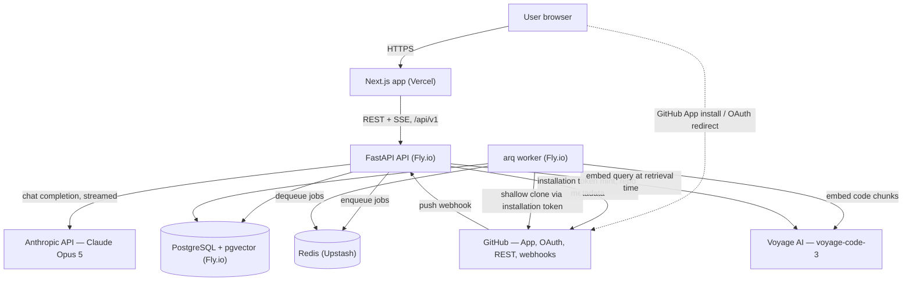
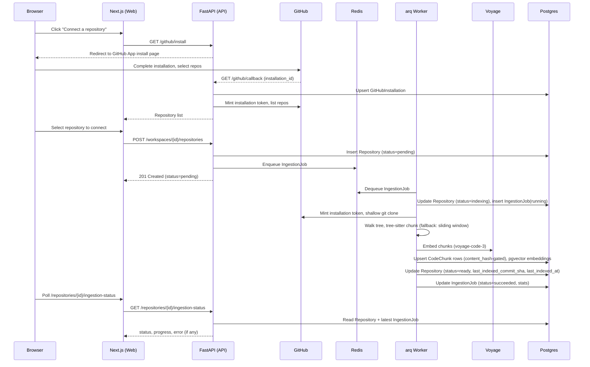
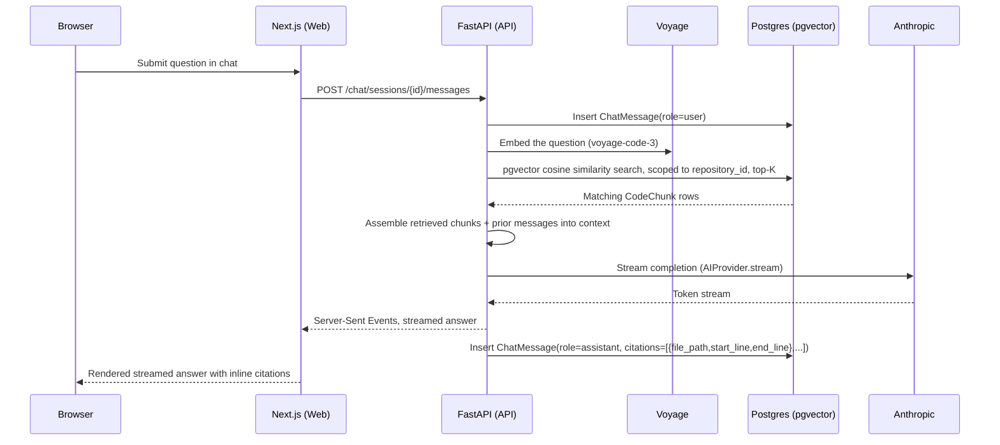

# RepoMind — System Architecture

**Status:** Living document, describes Phase 1 target architecture
**Date:** 2026-09-08
**Companion docs:** `frontend-architecture.md`, `backend-architecture.md`,
`ai-architecture.md`, `database-design.md`, `api-design.md`,
`deployment.md` (implementation depth on each area lives there; this
document gives the whole-system view and should stay consistent with all
of them).

## 1. System context

The browser never talks to GitHub, Anthropic, or Voyage directly except for
the GitHub App installation/OAuth redirect flow, which is a standard
browser redirect to github.com and back — no third-party credentials ever
reach the frontend. All AI-provider and GitHub API calls are made
server-side, so API keys and installation tokens never leave the backend.

**Deployment target note:** Vercel for the web app, Fly.io for the API and
worker processes, Fly-hosted Postgres with the pgvector extension, and
Upstash for Redis are the _intended_ shape of this system, as reflected
throughout this document. Specific current offerings — pgvector image
availability on Fly's managed Postgres, Upstash's pricing/limits for the
expected queue volume, and equivalents — should be reconfirmed at
provisioning time rather than treated as verified fact here; see
`deployment.md` for the operational detail and any adjustments made once
provisioning is actually attempted.

## 2. High-level component responsibilities

**Web (`frontend`, Next.js App Router on Vercel).** Renders the dashboard,
repository connection flow, ingestion status views, and chat UI. Server
components fetch initial page data directly from the API; client components
handle interactive state (chat streaming, ingestion polling) via React
Query. Holds no secrets and makes no direct calls to GitHub, Anthropic, or
Voyage — every data access goes through the FastAPI backend over
`/api/v1`.

**API (`backend`, FastAPI on Fly.io).** The single point of contact for
the frontend and for GitHub webhooks. Owns authentication (issuing and
validating RepoMind's own session JWTs), request validation, authorization
(workspace/repository ownership checks), synchronous reads (repository
list, ingestion status, chat history), and the chat request path (embed
query, retrieve, stream completion). Ingestion is not run inline in API
request handlers — the API only enqueues `IngestionJob` work onto Redis and
returns; the actual clone/chunk/embed work happens in the worker process.

**Worker (`app/workers`, arq on Fly.io, separate process from the API).**
Consumes queued jobs from Redis: repository ingestion (initial connect and
webhook-triggered re-ingestion). Performs the shallow clone, file tree walk,
tree-sitter chunking, embedding calls to Voyage, and writes `CodeChunk` rows
with their `pgvector` embeddings. Runs as its own deployable process so a
slow or failing ingestion job cannot degrade API request latency.

**Database (PostgreSQL + pgvector, Fly.io).** System of record for all
domain entities (§5 of the PRD's data model: `User`, `Workspace`,
`WorkspaceMember`, `GitHubInstallation`, `Repository`, `IngestionJob`,
`CodeChunk`, `ChatSession`, `ChatMessage`, `RefreshToken`) and for vector
search over `CodeChunk.embedding` via an HNSW index. One database serves
both relational and vector-search workloads — no separate vector store.

**GitHub App.** A single GitHub App is the identity provider for login
("Sign in with GitHub App"), the mechanism for granting repository access
(installation), the source of repository content (REST API, clone URLs
using installation tokens), and the event source for re-ingestion (`push`
webhooks). Isolated behind `app/integrations/github/` so nothing elsewhere
in the backend talks to GitHub's API surface directly.

**AI providers (Anthropic, Voyage).** Two distinct concerns behind two
abstractions in `app/ai/`: `AIProvider` (chat completion/streaming, backed
by Claude Opus 5 with adaptive thinking) and `EmbeddingProvider` (text
embedding, backed by Voyage's `voyage-code-3`, chosen because Anthropic has
no first-party embeddings API and Voyage is Anthropic's recommended
embeddings partner for code). Business logic depends only on these
interfaces, never on the underlying SDKs.

## 3. Request / data flow

### 3.1 Connecting and ingesting a repository

Failure handling: if the clone fails, a file exceeds size/type limits, or an
embedding call errors out, the worker records `IngestionJob.status=failed`
with a populated `error` field and sets `Repository.status=failed`. The
repository is never left in `indexing` indefinitely — every job either
succeeds or fails visibly.

### 3.2 Asking a chat question

Retrieval is always scoped to a single `repository_id` — a chat session
never sees chunks from another repository, even within the same workspace.
Citations are derived directly from the `file_path`/`start_line`/`end_line`
of the retrieved `CodeChunk` rows actually used to construct the answer, not
inferred after the fact from the model's text output.

## 4. Cross-cutting concerns

### 4.1 Auth model (summary — see `backend-architecture.md` for detail)

A single GitHub App provides login, repository installation, and webhooks.
After GitHub login, the backend issues its own session: a 15-minute access
token in an httpOnly `rm_session` cookie, and a 30-day rotated refresh token
in an httpOnly `rm_refresh` cookie scoped only to the refresh endpoint.
Refresh tokens are stored hashed (`RefreshToken.token_hash`) and revocable.
CSRF is mitigated with `SameSite=Lax` cookies plus a required custom header
on mutating requests — no separate CSRF token to manage. Installation
tokens (used for GitHub REST/clone access) are minted per use, live at most
one hour, and are never persisted to the database.

### 4.2 Error handling philosophy

No exception is caught and silently discarded anywhere in the request or
job path. Every error either propagates to a handler that produces a
consistent error response shape (see `api-design.md` for the exact
envelope) or, in the worker, is recorded on the `IngestionJob.error` field
and surfaced through `/repositories/{id}/ingestion-status`. A job or
request that fails leaves visible evidence of the failure — a `failed`
status with a message a user or developer can act on, not a swallowed
exception and a stuck `pending`/`indexing` state. Retries (e.g. transient
GitHub API or embedding-provider failures) are explicit and bounded, not
implemented as blanket catch-and-ignore blocks.

### 4.3 Observability (Phase 1 realistic scope)

This is an MVP, not an enterprise platform — observability is scoped to
what's needed to debug ingestion and chat issues in production without
over-building:

- Structured JSON logs from both the API and worker processes, including a
  request/job correlation id, so a single ingestion job's or chat request's
  log lines can be traced together.
- Every `IngestionJob` records its own timing (`started_at`, `finished_at`)
  and outcome (`stats` jsonb: files walked, chunks produced, embedding
  calls made) directly in Postgres — this is the primary ingestion
  observability surface, not an external APM tool.
- Basic uptime/error-rate monitoring on the API and worker processes
  (Fly.io's built-in metrics), not a dedicated APM/tracing vendor.
- No distributed tracing, no custom metrics pipeline, and no log
  aggregation service in Phase 1 — revisit if operating multiple worker
  instances or diagnosing cross-service latency becomes a real need.

## 5. What's built (Phase 0) vs. what this document describes (Phase 2+)

**Already built (Phase 0, see `docs/architecture/0001-foundation.md`):**

- Monorepo layout (`frontend`, `backend`, `packages/`), pnpm + Turborepo
  for the JS side, `uv`-managed Python API as an independent toolchain.
- FastAPI skeleton: layered `api/v1/routes` → `services` → `repositories` →
  `domain` structure, async SQLAlchemy + Alembic wired (no models yet
  beyond the empty aggregator in `app/domain/models.py`), a working health
  route.
- Next.js skeleton: App Router, Tailwind v4, shadcn/ui on `@base-ui/react`,
  React Query provider, a thin `apiFetch` wrapper as the sole HTTP boundary.
- `AIProvider` abstraction (`app/ai/provider.py`) with a working Anthropic
  implementation (`app/ai/providers/anthropic_provider.py`) — chat
  completion and streaming only; no embeddings yet.
- Empty `app/integrations/github/` and `app/workers/` packages — directory
  structure exists, no implementation.

**Described here for Phase 2+ implementation (everything else in this
document):** all domain models and migrations; the GitHub App integration
(`app_client.py`, `oauth.py`, `webhooks.py`, `repo_client.py`); the
`EmbeddingProvider` abstraction and its Voyage implementation; the
ingestion pipeline (clone, chunk, embed, store); the arq worker process and
Redis queue; the chat retrieval path; the session/auth flow end to end;
route implementations beyond `/health`; and the frontend screens (auth,
dashboard, repository connect, ingestion status, chat).

## 6. Why not X

**Why not a separate vector database instead of pgvector?** A dedicated
vector store (Pinecone, Qdrant, Weaviate) adds an operational dependency,
a second network hop on every retrieval, and a second place for
repository-scoped access control to be enforced correctly. At Phase 1's
scale — one embedding per code chunk per connected repository, queried with
an HNSW index — Postgres with pgvector keeps vector search transactionally
consistent with the relational data it's scoped by (`repository_id`,
ownership checks) in a single query, and removes an entire service from the
deployment and failure surface. Revisit only if embedding volume or query
latency actually outgrows what a well-indexed Postgres instance can serve.

**Why arq instead of Celery?** arq is async-native and shares the same
asyncio runtime and Redis dependency the rest of the backend already uses
(FastAPI + `asyncpg`), so job handlers can `await` the same async
SQLAlchemy sessions and HTTP clients as the API without a sync/async
bridge. Celery is more mature and has a broader plugin ecosystem, but its
worker model is fundamentally synchronous (or bolts on async support) and
it brings its own broker abstraction and configuration surface RepoMind
doesn't need — Redis is already the right broker here, and arq talks to it
directly.

**Why Server-Sent Events instead of WebSockets for chat?** Chat streaming
in RepoMind is one-directional per request: the client sends one question
and receives one streamed answer, it does not need a persistent
bidirectional channel, server-initiated pushes unrelated to a request, or
multiplexed concurrent streams over one connection. SSE runs over plain
HTTP, works through standard proxies and load balancers without special
handling, reconnects natively, and is simpler to reason about on both ends
than a WebSocket connection whose lifecycle (auth, reconnect, backpressure)
would otherwise have to be built by hand for a capability SSE already
provides. Revisit if a feature genuinely needs bidirectional or
server-initiated push (e.g. live multi-user collaboration on a session).
