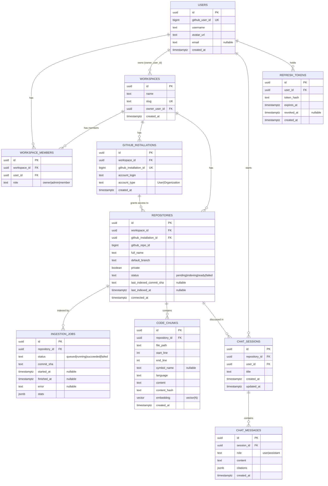

# Database Design

**Status:** Accepted (as the Phase 1 target schema for AI ingestion — not yet built)
**Date:** 2026-09-08
**Depends on:** `docs/architecture/0001-foundation.md` (async SQLAlchemy + Alembic setup)
**Cross-references:** `docs/architecture/ai-architecture.md` (ingestion/retrieval pipelines
that read and write `code_chunks` and `ingestion_jobs`), `backend-architecture.md`
(GitHub installation-token flow that populates `github_installations`)

> **Note:** the `repositories`/`github_installations` tables and the
> `organization_role` enum values described below are the Phase 1 target
> shape for the eventual AI-ingestion product, and predate the real
> schema. Phases 2 and 3 shipped a different, real schema —
> `users`, `organizations`, `organization_members` (roles are
> `owner`/`admin`/`developer`/`viewer`, not `owner`/`admin`/`member`),
> `sessions`, `refresh_tokens`, `audit_logs` (ADR 0002), and
> `github_installations`, `repositories`, `branches`, `commits`,
> `pull_requests`, `issues`, `repository_memberships`, `webhook_events`
> (ADR 0003, with a materially different `repositories`/
> `github_installations` shape than what's sketched here — no
> `code_chunks`/embeddings yet). Treat this document as the plan for
> Phase 4+ AI ingestion, and the two ADRs as the current, actually-applied
> migrations.

PostgreSQL, accessed via async SQLAlchemy (`asyncpg` driver, per ADR 0001).
The `pgvector` extension is required for `code_chunks.embedding` and is
enabled via `CREATE EXTENSION IF NOT EXISTS vector` in an Alembic migration.

This is the first real schema in the project. Phase 0 shipped zero domain
models (`app/domain/models.py` was a placeholder), so every table below is
new, and the migration that creates them is the first real Alembic
migration this project will have.

## 1. Entities

Nine entities, all defined as SQLAlchemy ORM models under `app/domain/`,
aggregated into `app/domain/models.py` for Alembic autogenerate to see:

| Entity             | Table                  | Purpose                                               |
| ------------------ | ---------------------- | ----------------------------------------------------- |
| User               | `users`                | Authenticated GitHub-linked account                   |
| Workspace          | `workspaces`           | Billing/access boundary; owns installations and repos |
| WorkspaceMember    | `workspace_members`    | User's role within a workspace                        |
| GitHubInstallation | `github_installations` | A GitHub App installation linked to a workspace       |
| Repository         | `repositories`         | A connected GitHub repo within a workspace            |
| IngestionJob       | `ingestion_jobs`       | One ingestion run against a repository at a commit    |
| CodeChunk          | `code_chunks`          | A chunk of source/prose with its embedding            |
| ChatSession        | `chat_sessions`        | A conversation about one repository                   |
| ChatMessage        | `chat_messages`        | One turn (user or assistant) in a session             |
| RefreshToken       | `refresh_tokens`       | Long-lived session token for a user                   |

## 2. Entity-relationship diagram

## 3. Schema

All tables use a `uuid` primary key (`id`, server-generated via
`gen_random_uuid()` — requires `pgcrypto` or Postgres 13+'s built-in
`gen_random_uuid()`, confirm which is available on the target Postgres
version at implementation time). All foreign keys cascade delete downward,
per the ownership hierarchy: deleting a `Workspace` cascades to
`WorkspaceMember`, `GitHubInstallation`, and `Repository` (and everything
under a `Repository`); deleting a `Repository` cascades to `CodeChunk`,
`IngestionJob`, and `ChatSession` (which cascades to `ChatMessage`).

### 3.1 `users`

| Column           | Type          | Nullable | Notes                                |
| ---------------- | ------------- | -------- | ------------------------------------ |
| `id`             | `uuid` PK     | no       |                                      |
| `github_user_id` | `bigint`      | no       | **unique**                           |
| `username`       | `text`        | no       |                                      |
| `avatar_url`     | `text`        | no       |                                      |
| `email`          | `text`        | **yes**  | GitHub may not expose a public email |
| `created_at`     | `timestamptz` | no       | default `now()`                      |

Index: unique on `github_user_id` (also the natural lookup key on GitHub
OAuth callback).

### 3.2 `workspaces`

| Column          | Type                   | Nullable | Notes               |
| --------------- | ---------------------- | -------- | ------------------- |
| `id`            | `uuid` PK              | no       |                     |
| `name`          | `text`                 | no       |                     |
| `slug`          | `text`                 | no       | **unique**          |
| `owner_user_id` | `uuid` FK → `users.id` | no       | `ON DELETE CASCADE` |
| `created_at`    | `timestamptz`          | no       | default `now()`     |

Index: unique on `slug`. (The fact sheet also lists `(workspace_id, slug)`
unique in the context of per-workspace uniqueness elsewhere in this
document — for `workspaces` itself, `slug` is globally unique since slugs
are the workspace's public URL segment.)

### 3.3 `workspace_members`

| Column         | Type                        | Nullable | Notes                      |
| -------------- | --------------------------- | -------- | -------------------------- |
| `id`           | `uuid` PK                   | no       |                            |
| `workspace_id` | `uuid` FK → `workspaces.id` | no       | `ON DELETE CASCADE`        |
| `user_id`      | `uuid` FK → `users.id`      | no       | `ON DELETE CASCADE`        |
| `role`         | `text` (or enum)            | no       | `owner`\|`admin`\|`member` |

Constraints: unique on `(workspace_id, user_id)` — a user has exactly one
role per workspace. Index on `user_id` for "workspaces I belong to" queries.

### 3.4 `github_installations`

| Column                   | Type                        | Nullable | Notes                  |
| ------------------------ | --------------------------- | -------- | ---------------------- |
| `id`                     | `uuid` PK                   | no       |                        |
| `workspace_id`           | `uuid` FK → `workspaces.id` | no       | `ON DELETE CASCADE`    |
| `github_installation_id` | `bigint`                    | no       | **unique**             |
| `account_login`          | `text`                      | no       |                        |
| `account_type`           | `text`                      | no       | `User`\|`Organization` |
| `created_at`             | `timestamptz`               | no       | default `now()`        |

Index: unique on `github_installation_id` (GitHub's own installation ID,
needed to look up the installation on webhook delivery — see
`backend-architecture.md`).

### 3.5 `repositories`

| Column                    | Type                                  | Nullable | Notes                                    |
| ------------------------- | ------------------------------------- | -------- | ---------------------------------------- |
| `id`                      | `uuid` PK                             | no       |                                          |
| `workspace_id`            | `uuid` FK → `workspaces.id`           | no       | `ON DELETE CASCADE`                      |
| `github_installation_id`  | `uuid` FK → `github_installations.id` | no       | `ON DELETE CASCADE`                      |
| `github_repo_id`          | `bigint`                              | no       | GitHub's numeric repo ID                 |
| `full_name`               | `text`                                | no       | e.g. `acme/widgets`                      |
| `default_branch`          | `text`                                | no       |                                          |
| `private`                 | `boolean`                             | no       |                                          |
| `status`                  | `text` (or enum)                      | no       | `pending`\|`indexing`\|`ready`\|`failed` |
| `last_indexed_commit_sha` | `text`                                | **yes**  | null until first successful ingestion    |
| `last_indexed_at`         | `timestamptz`                         | **yes**  | null until first successful ingestion    |
| `connected_at`            | `timestamptz`                         | no       | default `now()`                          |

Constraints: unique on `(workspace_id, github_repo_id)` — the same GitHub
repo cannot be connected twice to one workspace. Index on
`github_installation_id` (FK) and on `status` (repo list views filter/sort
by status).

### 3.6 `ingestion_jobs`

| Column          | Type                          | Nullable | Notes                                                                                                                           |
| --------------- | ----------------------------- | -------- | ------------------------------------------------------------------------------------------------------------------------------- |
| `id`            | `uuid` PK                     | no       |                                                                                                                                 |
| `repository_id` | `uuid` FK → `repositories.id` | no       | `ON DELETE CASCADE`                                                                                                             |
| `status`        | `text` (or enum)              | no       | `queued`\|`running`\|`succeeded`\|`failed`                                                                                      |
| `commit_sha`    | `text`                        | no       | commit being indexed                                                                                                            |
| `started_at`    | `timestamptz`                 | **yes**  | null while queued                                                                                                               |
| `finished_at`   | `timestamptz`                 | **yes**  | null until terminal                                                                                                             |
| `error`         | `text`                        | **yes**  | populated on `failed`                                                                                                           |
| `stats`         | `jsonb`                       | no       | default `{}`; e.g. `files_processed`, `chunks_created`, `chunks_reused`, `tokens_embedded` — see `ai-architecture.md` section 2 |

Index: `(repository_id, started_at)` or `(repository_id, id)` for
chronological job-history listing per repo.

### 3.7 `code_chunks`

| Column          | Type                          | Nullable | Notes                                                                                                                                                                                                                                  |
| --------------- | ----------------------------- | -------- | -------------------------------------------------------------------------------------------------------------------------------------------------------------------------------------------------------------------------------------- |
| `id`            | `uuid` PK                     | no       |                                                                                                                                                                                                                                        |
| `repository_id` | `uuid` FK → `repositories.id` | no       | `ON DELETE CASCADE`                                                                                                                                                                                                                    |
| `file_path`     | `text`                        | no       | repo-relative path                                                                                                                                                                                                                     |
| `start_line`    | `int`                         | no       | 1-indexed                                                                                                                                                                                                                              |
| `end_line`      | `int`                         | no       | inclusive                                                                                                                                                                                                                              |
| `symbol_name`   | `text`                        | **yes**  | null for sliding-window/prose chunks                                                                                                                                                                                                   |
| `language`      | `text`                        | no       | e.g. `python`, `typescript`, `markdown`                                                                                                                                                                                                |
| `content`       | `text`                        | no       | raw chunk text                                                                                                                                                                                                                         |
| `content_hash`  | `text`                        | no       | sha256 of normalized content                                                                                                                                                                                                           |
| `embedding`     | `vector(N)`                   | no       | **N depends on the embedding provider's actual output dimension — confirmed at implementation time, see ai-architecture.md section 1.2. Do not treat any specific number as fact until confirmed against Voyage's live API response.** |
| `created_at`    | `timestamptz`                 | no       | default `now()`                                                                                                                                                                                                                        |

Constraints/indexes:

- Composite index on `(repository_id, content_hash)` — this is the index
  the incremental re-ingestion diff (ai-architecture.md section 2, step 4)
  runs against; it needs to be fast since it's evaluated on every push.
- HNSW index on `embedding` using `vector_cosine_ops`, for approximate
  nearest-neighbor search (see section 4 below).
- Index on `repository_id` alone — every retrieval query and every
  ingestion diff filters by it.

### 3.8 `chat_sessions`

| Column          | Type                          | Nullable | Notes                           |
| --------------- | ----------------------------- | -------- | ------------------------------- |
| `id`            | `uuid` PK                     | no       |                                 |
| `repository_id` | `uuid` FK → `repositories.id` | no       | `ON DELETE CASCADE`             |
| `user_id`       | `uuid` FK → `users.id`        | no       | `ON DELETE CASCADE`             |
| `title`         | `text`                        | no       | e.g. derived from first message |
| `created_at`    | `timestamptz`                 | no       | default `now()`                 |
| `updated_at`    | `timestamptz`                 | no       | bumped on new message           |

Index: `(repository_id, created_at)` for chronological session listing per
repo; index on `user_id` for "my chats" views.

### 3.9 `chat_messages`

| Column       | Type                           | Nullable | Notes                                                                                                                                          |
| ------------ | ------------------------------ | -------- | ---------------------------------------------------------------------------------------------------------------------------------------------- |
| `id`         | `uuid` PK                      | no       |                                                                                                                                                |
| `session_id` | `uuid` FK → `chat_sessions.id` | no       | `ON DELETE CASCADE`                                                                                                                            |
| `role`       | `text` (or enum)               | no       | `user`\|`assistant`                                                                                                                            |
| `content`    | `text`                         | no       |                                                                                                                                                |
| `citations`  | `jsonb`                        | no       | default `[]`; list of `{file_path, start_line, end_line}` — only chunks actually sent to the model that turn, see ai-architecture.md section 3 |
| `created_at` | `timestamptz`                  | no       | default `now()`                                                                                                                                |

Index: `(session_id, created_at)` for chronological message listing —
append-only table, always read in order for a given session.

### 3.10 `refresh_tokens`

| Column       | Type                   | Nullable | Notes                     |
| ------------ | ---------------------- | -------- | ------------------------- |
| `id`         | `uuid` PK              | no       |                           |
| `user_id`    | `uuid` FK → `users.id` | no       | `ON DELETE CASCADE`       |
| `token_hash` | `text`                 | no       | never store the raw token |
| `expires_at` | `timestamptz`          | no       |                           |
| `revoked_at` | `timestamptz`          | **yes**  | null while active         |
| `created_at` | `timestamptz`          | no       | default `now()`           |

Index: on `token_hash` (lookup on refresh), and on `(user_id, revoked_at)`
for "revoke all sessions for this user" operations.

## 4. Vector indexing: HNSW over IVFFlat, and the scoping question

### 4.1 HNSW vs. IVFFlat

The `code_chunks.embedding` column is indexed with pgvector's HNSW index
type (`vector_cosine_ops`), not IVFFlat:

- IVFFlat requires a pre-tuned `lists` parameter sized to the table's
  expected row count at index-build time. This table grows continuously as
  more repositories are ingested and as existing repositories are
  re-ingested on every push — there is no single "expected size" to tune
  for, and a `lists` value tuned for today's data degrades in recall as the
  table grows past it.
- HNSW has no such pre-sizing requirement and gives a better recall/latency
  tradeoff for a table shaped like this one — continuously, incrementally
  growing rather than bulk-loaded once.
- The cost is slower index builds (and slower inserts against an existing
  HNSW index) compared to IVFFlat. This is acceptable here because chunks
  are inserted incrementally (per ingestion job, tens to low thousands of
  rows at a time), never as a single bulk load of an entire corpus.

### 4.2 Scoping by `repository_id`: single global index vs. per-repository partitioning

Every retrieval query filters by `repository_id` (a chat session belongs to
exactly one repository). Two ways to make that filter efficient alongside
the HNSW search:

1. **A single global HNSW index over all of `code_chunks`, with
   `repository_id` as a `WHERE` clause on top of the ANN search** (plus a
   plain b-tree index on `repository_id` to help the planner, and the
   composite `(repository_id, content_hash)` index already needed for
   ingestion diffing).
2. **Per-repository partitioning** (e.g. Postgres table partitioning by
   `repository_id`, or a separate HNSW index per repository), so each ANN
   search only ever touches one repository's vectors.

**Recommendation for MVP scale: option 1, the single global index.**
Reasoning:

- A filtered HNSW search (ANN search combined with a `WHERE repository_id =
:x` predicate) is a well-supported pgvector query pattern, and at this
  project's expected scale (single-digit-to-low-hundreds of repositories,
  each a few thousand to tens of thousands of chunks) the total corpus size
  is small enough that recall and latency both stay well within acceptable
  bounds without partitioning.
- Partitioning is real operational complexity — partition management,
  migrations that must be partition-aware, and (if using per-repository
  indexes rather than table partitioning) index proliferation as
  repositories are added — that isn't justified until there's evidence the
  global index is actually the bottleneck.
- **Revisit if:** the number of repositories or total chunk count grows
  large enough that a single global HNSW index's build time, memory
  footprint, or filtered-search latency becomes a measured problem. At that
  point, table partitioning by `repository_id` (with a per-partition HNSW
  index) is the natural next step, since partition pruning would let each
  query touch only the relevant repository's data and index.

## 5. Migration strategy

One Alembic migration per logical schema change. Autogenerate is used as a
starting point and reviewed by hand on every migration — never trusted
blindly for structural changes. In particular, autogenerate does **not**
detect or generate:

- `CREATE EXTENSION IF NOT EXISTS vector` — must be hand-written with
  `op.execute(...)` in the first migration, before any table referencing
  `vector(N)` is created.
- The HNSW index on `code_chunks.embedding` — pgvector's index types are
  not part of SQLAlchemy's/Alembic's built-in vocabulary; this is also
  hand-written via `op.execute("CREATE INDEX ... USING hnsw (embedding
vector_cosine_ops)")` (or the equivalent construct if a
  Postgres-dialect helper is adopted later).

Expected first migration (Phase 2): one migration that enables the `vector`
extension and creates all nine tables above with their constraints and
indexes, including the HNSW index. This is the first real migration in the
project's history — Phase 0 shipped no domain models, so there was nothing
to migrate until now.
