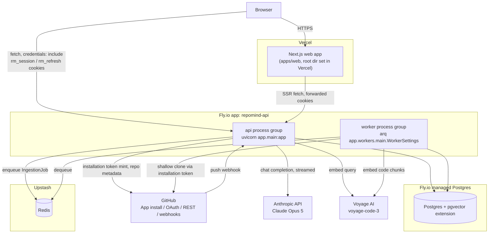

# Deployment Architecture

**Status:** Design (Phase 1) — nothing described here is provisioned yet
**Scope:** where each piece of RepoMind runs, how it gets there, environment
and secrets handling, and the operational discipline (rollbacks, migrations)
that goes with it.
**Companion docs:** `docs/architecture/system-architecture.md` (component
responsibilities), `docs/architecture/backend-architecture.md` (what the API
and worker processes actually do), `docs/architecture/frontend-architecture.md`
(the frontend's cookie/CORS dependency on the domain topology this doc sets
up — see §3). This document supersedes the previous stub at this path.

> **Note:** the worker entrypoint below is written as
> `app.workers.main.WorkerSettings` / `IngestionJob` (the Phase 1 plan).
> Phase 4 actually built it as `app.workers.settings.WorkerSettings`
> (tasks `index_repository`, `sync_repository` in `app/workers/tasks.py`)
> and `IndexingJob`, not `IngestionJob` — see
> `docs/architecture/0004-codebase-indexing.md`. Nothing in this document
> is provisioned yet, so this is a correction to apply when it is, not a
> description of something already deployed differently.

## 1. Topology



Nothing here is provisioned as of this writing (see the superseded stub this
file replaces). This is the intended shape, to be stood up when Phase 1
implementation begins.

## 2. Web: Vercel

`apps/web` deploys to Vercel with the project's **root directory** set to
`apps/web` (Vercel's monorepo support: it runs `pnpm install`/`pnpm build`
scoped to that directory while still resolving the pnpm workspace at the
repo root, since `apps/web`'s `package.json` participates in the top-level
`pnpm-workspace.yaml`/Turborepo graph recorded in `0001-foundation.md`).

Vercel's GitHub integration creates a **preview deployment per pull
request** automatically — no custom workflow needed for this, it's Vercel's
default PR behavior. Production deploys from `main`. `NEXT_PUBLIC_API_URL`
is the one environment variable the web app needs (already scaffolded in
`apps/web/.env.example`); it differs per Vercel environment (preview vs.
production — see §5).

## 3. Domains and the cookie/CORS constraint

This section exists because it is easy to get wrong and would silently break
auth in production if skipped. RepoMind's auth cookies (`rm_session`,
`rm_refresh`) are `httpOnly` and `SameSite=Lax`
(`backend-architecture.md` §2.2). The frontend calls the API directly from
the browser for anything client-side (React Query polling, the chat SSE
`fetch`, `frontend-architecture.md` §4/§10) — that is a cross-_origin_
request (different subdomain), and `SameSite=Lax` only permits a cookie on a
cross-origin request if the two are still same-_site_ (same registrable
domain). Concretely, this requires:

- The web app served from a custom domain under the project's apex, e.g.
  `app.<domain>`, not the default `*.vercel.app` URL.
- The API served from a sibling subdomain of the same apex, e.g.
  `api.<domain>`, not the default `*.fly.dev` URL.
- The API's `CORSMiddleware` `allow_origins` set to the exact
  `https://app.<domain>` origin with `allow_credentials=True`
  (`backend-architecture.md` §2.5), and every client-side `fetch` call
  setting `credentials: "include"` explicitly (the browser does not include
  cross-origin cookies by default even when same-site rules would allow it).

**Known gap this creates for Vercel preview deployments:** a PR preview is
served from a random `*.vercel.app` subdomain, which is **not** same-site
with `api.<domain>` under this scheme. Cookie-based auth will not work from
a preview URL against the production-domain API as designed above. This is
not resolved in this document — options to evaluate before Phase 2 auth
testing on previews include a per-branch custom domain (Vercel supports
wildcard custom domains on some plans — **confirm current plan support before
relying on it**), a temporary relaxed cookie policy scoped to a preview-only
API path, or simply treating previews as UI-review-only and running full
auth flows against a fixed staging/production-like environment instead. This
is called out explicitly rather than silently assumed away.

## 4. API and worker: Fly.io

**Why Fly over Railway** (Railway was the Phase 0 placeholder choice,
`0001-foundation.md` §"Deployment target"): now that ingestion is scoped as
a genuinely long-running background process (shallow clone, tree walk,
chunking, embedding calls — minutes, not seconds), Fly's model gives more
direct control over which region a process runs in relative to its Postgres
instance, and over persistent volumes if the worker needs local scratch disk
during a clone/chunk pass. Fly also supports running distinct **process
groups** from one app definition, which fits the API/worker split described
below without needing two separately-billed platform projects. This is a
judgment call made at the architecture stage, not a benchmarked platform
comparison — revisit if Fly's actual operational cost or reliability at
RepoMind's scale doesn't bear this out.

**One Fly app, two process groups.** `apps/api/fly.toml` defines both
processes from the same image:

```toml
app = "repomind-api"
primary_region = "iad"  # placeholder — pick based on Postgres region

[processes]
api = "uvicorn app.main:app --host 0.0.0.0 --port 8080"
worker = "arq app.workers.main.WorkerSettings"

[[services]]
processes = ["api"]
internal_port = 8080
protocol = "tcp"
  [[services.ports]]
  handlers = ["tls", "http"]
  port = 443
```

Only the `api` process group is attached to a `[[services]]` block, so only
it gets a public IP/HTTPS endpoint; `worker` runs with no exposed service —
it only talks outbound to Postgres, Redis, GitHub, and Voyage. `fly deploy`
redeploys both process groups from one image by default; `fly deploy
--process-group api` (or `worker`) can target one independently once that
granularity is actually needed. If scaling requirements diverge enough later
to want independent regions or independent restart policies for the worker,
splitting into two separate Fly apps is a straightforward migration from this
starting point — not a redesign.

**Why the worker must never run inside the API's request-handling process:**
a crashed, slow, or resource-heavy ingestion job (a large repository clone, a
pathological embedding batch) must never degrade or block API response
latency for unrelated requests — chat requests and repository-status polls
have to stay fast regardless of what ingestion is doing. The worker also
needs to scale on a different axis than the API (ingestion volume vs. request
concurrency); coupling them into one process means one scaling knob for two
unrelated load patterns. This is the same reasoning recorded in
`backend-architecture.md`'s worker section — it applies at the deployment
layer as an explicit rule, not just a code-organization one: no code path
that handles an HTTP request may perform ingestion work inline, ever, even
under load or a queue backlog.

## 5. Database: Postgres + pgvector on Fly

One Fly-managed Postgres instance, with the `pgvector` extension enabled for
`CodeChunk.embedding` similarity search (`system-architecture.md` §2, §6).

**Confirm before provisioning:** whether Fly's current managed-Postgres
offering supports the `pgvector` extension out of the box, and under what
plan tier, is not verified here — this document records pgvector-on-Fly as
the intended shape based on the architecture's requirements, not as a
checked fact against Fly's current platform documentation. If it turns out
unsupported or restricted, the fallback is a Postgres image with pgvector
pre-installed run as a Fly app with a volume (more ops overhead, still no
separate vector-store service), not a different vector database — see
`system-architecture.md` §6 ("why not a separate vector database") for why
that fallback is preferred over introducing Pinecone/Qdrant/Weaviate.

Both the API and worker connect via `DATABASE_URL`
(`postgresql+asyncpg://...`, same driver as the Phase 0 local
`docker-compose.yml` setup) as a Fly secret, not a plaintext config value.

## 6. Redis: Upstash

Redis serves two purposes: the arq broker (job queue between API and worker,
`backend-architecture.md` §"Workers") and the GitHub installation-token
cache (55-minute TTL, keyed by `installation_id`,
`backend-architecture.md` §3.1). Upstash is the intended provider — chosen
for a managed, low-ops Redis with no server to patch — but **its current
pricing/limits at RepoMind's expected queue and cache volume are not
verified here and should be confirmed before provisioning**, same caveat as
§5. Both API and worker connect via `REDIS_URL` as a Fly secret.

## 7. Environments

Two environments: `preview` and `production`. No per-PR ephemeral backend.

- **`production`** — `main` branch. Vercel production deployment,
  `repomind-api` Fly app running both process groups, the one Postgres and
  Redis instance.
- **`preview`** — every Vercel PR preview deployment points at the _same_
  shared Fly backend and the _same_ Postgres/Redis instance production would
  otherwise use, or a single shared non-production backend/DB if kept
  separate from production data — this document treats "preview shares one
  backend" as the decision; whether that shared backend is itself literally
  production or a second fixed environment is an operational choice to make
  when provisioning, not re-litigated per PR either way.

This is a **deliberate simplification, not an oversight**: a fully isolated
backend + database per PR (ephemeral Fly app, ephemeral Postgres, migrated
fresh) is the "correct" pattern for larger teams, but at this project's
stage it multiplies infrastructure cost and CI complexity for a benefit
(perfect preview isolation) that a small team reviewing its own PRs doesn't
need yet. The tradeoff being accepted: two PRs under review at the same time
share mutable state (repository connections, chat sessions) against the same
backend, and a PR that changes API behavior affects every preview's backend
calls simultaneously, not just its own. Revisit if concurrent PR review
volume makes that collision a real problem — it is not being ruled out
permanently, just deferred past Phase 1.

## 8. Secrets management

**Vercel** (Project Settings → Environment Variables, scoped per
environment):

| Variable              | Preview                | Production             |
| --------------------- | ---------------------- | ---------------------- |
| `NEXT_PUBLIC_API_URL` | shared/staging API URL | `https://api.<domain>` |

**Fly secrets** (`fly secrets set KEY=value -a repomind-api`), never in
source control — consistent with both `.env.example` files already being
gitignored per Phase 0:

| Secret                                      | Purpose                                                                                                                                            |
| ------------------------------------------- | -------------------------------------------------------------------------------------------------------------------------------------------------- |
| `DATABASE_URL`                              | Postgres connection string (asyncpg)                                                                                                               |
| `REDIS_URL`                                 | Upstash connection string                                                                                                                          |
| `ANTHROPIC_API_KEY`                         | Claude Opus 5 chat completion/streaming                                                                                                            |
| `VOYAGE_API_KEY`                            | voyage-code-3 embeddings                                                                                                                           |
| `GITHUB_APP_ID`                             | App-JWT signing (`app_client.py`, s2s auth)                                                                                                        |
| `GITHUB_APP_PRIVATE_KEY`                    | Same — PEM private key, see note below                                                                                                             |
| `GITHUB_CLIENT_ID` / `GITHUB_CLIENT_SECRET` | User OAuth code exchange (login flow) — already reserved in Phase 0 config, listed here for completeness alongside the App-level credentials above |
| `GITHUB_WEBHOOK_SECRET`                     | HMAC verification on push webhooks                                                                                                                 |
| `JWT_SECRET`                                | Signs `rm_session`                                                                                                                                 |

`GITHUB_APP_PRIVATE_KEY` is a multi-line PEM value, which needs different
handling than a single-line secret — setting it naively from a shell
variable can mangle newlines. The safe pattern is to pipe the file directly:

```bash
fly secrets set GITHUB_APP_PRIVATE_KEY="$(cat github-app-private-key.pem)" -a repomind-api
```

**Confirm this against Fly's current `flyctl secrets set` documentation
before provisioning** — the exact multi-line-value handling (quoting
behavior, any size limit) is not independently verified here.

## 9. CI/CD

`.github/workflows/ci.yml` stays exactly as it is — it already runs
lint/typecheck/build for `apps/web` and lint/typecheck/test for `apps/api`
against a Postgres service container, on every push to `main` and every PR.
Nothing in this document changes it.

**Planned, not yet created** (out of scope for this doc-only phase — no
`deploy.yml` exists yet): a GitHub Actions workflow that runs `fly deploy`
against `repomind-api` on merge to `main`, after CI passes. Web deploys are
not part of this workflow at all — Vercel's own GitHub integration deploys
independently of GitHub Actions (both preview and production), so `deploy.yml`
only needs to own the Fly side. Sketch of what that workflow will need, for
when it's actually written: `flyctl deploy` authenticated via a
`FLY_API_TOKEN` GitHub Actions secret, gated on the `ci.yml` `api` job (and
probably `web`, since a broken frontend build shouldn't block an API deploy
but a broken API shouldn't ship either) passing first.

## 10. Observability at MVP scale

Deliberately small, matching `system-architecture.md` §4.3:

- Structured JSON logs (not `print`) from both the API and worker, with a
  request/job correlation id.
- Fly's built-in log aggregation and basic metrics (`fly logs`, the Fly
  dashboard) as the only log/metrics surface for now — no shipped-out log
  aggregation service.
- Ingestion-specific observability lives in Postgres itself
  (`IngestionJob.started_at`/`finished_at`/`stats`), not an external tool —
  this is the primary debugging surface for ingestion issues.
- **A dedicated APM/error-tracking tool (Sentry or equivalent) is a near-term
  addition once there's real production traffic, not a Phase 1 blocker.**
  Wiring it in later is additive (an SDK init call, a DSN secret) and does
  not require anything in this document to change first.

## 11. Rollback strategy

- **Web:** Vercel keeps every deployment and supports instant rollback to a
  previous one from the dashboard or CLI — no rebuild required.
- **API/worker:** `fly releases` lists deploy history for `repomind-api`;
  `fly releases rollback` (or redeploying a prior image) reverts both process
  groups together, since they share one app/image in the model described in
  §4.
- **The actual risk is never the application code — it's the database.** A
  redeploy of old application code cannot undo a migration that already ran
  and already changed data or dropped a column the old code expects. This is
  a standing rule for this project, not a one-time note:
  - Migrations must be **backward-compatible with the previous release** at
    the moment they run — the previous version of the code must still work
    against the new schema for the duration of a deploy.
  - Breaking schema changes (renaming/removing a column, changing a type)
    use an **expand/contract pattern**: expand (add the new column/table,
    dual-write or backfill), deploy code that reads the new shape, then
    contract (drop the old column/table) only in a later, separate
    migration/deploy once nothing depends on the old shape anymore.
  - A migration is not "rolled back" by rolling back the release — rolling
    back application code while a destructive migration's effects are still
    live in the database does not restore the previous data shape. Treat
    every migration as a one-way door unless it was explicitly written with
    its own down-migration verified to actually restore prior behavior.

## 12. What this document does not cover

No `deploy.yml` is created here (§9) — writing it is implementation work,
out of scope for this docs-only phase. No infrastructure is actually
provisioned by this document; every Fly app name, region, and domain above
is illustrative and subject to change when someone actually runs
`fly launch`. The two "confirm before provisioning" flags (§5 pgvector, §6
Upstash) and the preview-cookie gap (§3) are the three open questions this
document intentionally leaves unresolved rather than guessing at.
